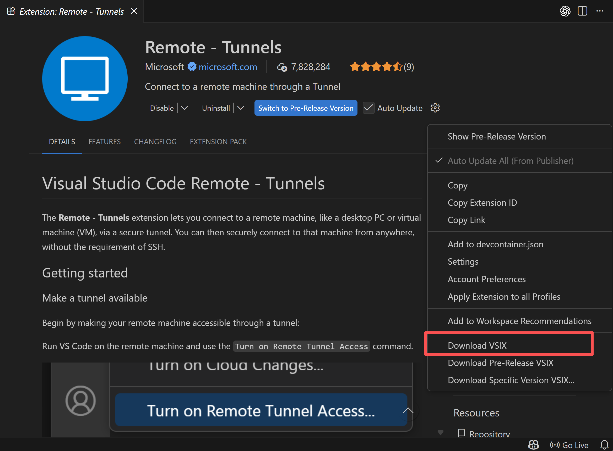
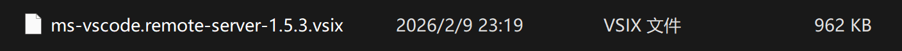

### cursor tunnel

#### Step1: install cursor tunnel on server

```bash
# linux arm 架构下要这么装
curl -Lk 'https://api2.cursor.sh/updates/download-latest?os=cli-alpine-arm64' -o cursor_cli.tar.gz

# x86 64 架构: 这个是 work 的
curl -Lk 'https://api2.cursor.sh/updates/download-latest?os=cli-alpine-x64' -o cursor_cli.tar.gz

tar -xzf cursor_cli.tar.gz

# 启动指令
cursor tunnel
```


#### Step2: install tunnel extension in IDE

> 我看过 cursor 的论坛，这个方法有一定概率会装失败，如果装失败了，就不要浪费时间在 cursor tunnel 上了。换别的方法吧

下一步是在 cursor 里边装 tunnel 的 extension，但是 cursor 的 marketplace 把 remote tunnel 删了。。。得自己装

第一步：去 **vscode** 里边下 remote tunnel 的 vsix 文件，下载到你本地的电脑上



于是乎，你会得到这样的一个文件




第二步：在 cursor 里边安装这个 vsix 文件

这里要用 command line 安装

Ctrl + Shift + P 打开 cursor 的 command line

然后输入

```
Extensions: Install from VSIX...
```


第三步：用 tunnel extension 连接到 server 上

也要用 command line 链接，不知道为啥 remote explorer 里边不会显示 tunnel 

Ctrl + Shift + P 打开 cursor 的 command line

然后输入

```
Remote-Tunnels: Connect to Tunnel...
```


但是注意，第一次链接的时候 server download 会卡死，看起来是因为 cursor 把这个东西给阻塞了。所以这个时候要重启 cursor，就能正常链接上 tunnel 了


