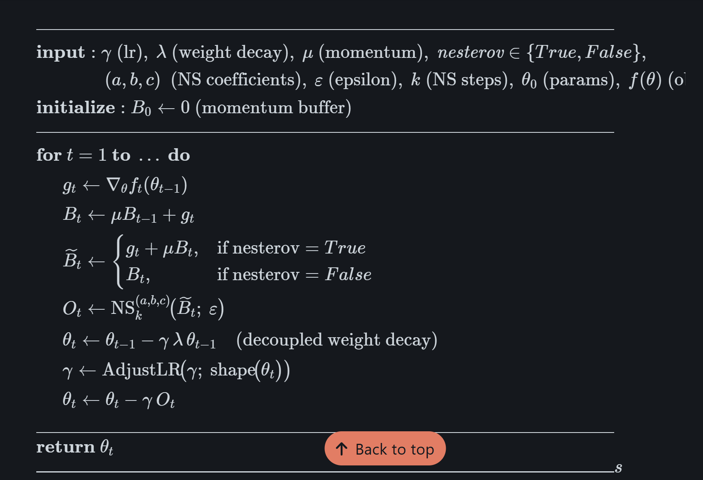

### Stefiel 和 Muon 优化器

https://zhuanlan.zhihu.com/p/13401683661

苏神的 blog 里边提到了这样一件事情
$$
\text{msgin}(M) = \arg \min_{O^\top O=I} \| M - O \|_F^2
$$
实际上说明 msign 这个东西找的就是 M 在 stefiel manifold 上最近的投影


其实一个最简单的实践方式是把更新后的矩阵重新用 msign 投影到 Stefiel manifold 上边去就行了。


### Adjust Learning Rate


Muon 里边有好几种不同 adjust learning rate 的方式，训起来效果差很多

主要有三种

1. Spectrum norm
2. RMS norm
3. None 什么都不调整

```python
# Spectrum norm
def adjust_lr_spectral_norm(lr, param_shape, flatten):
    # Adjust from spectral norm 1 to RMS operator norm 1
    # https://arxiv.org/abs/2310.17813
    if flatten:
        fan_out = param_shape[0]
        fan_in = math.prod(param_shape[1:])
    else:
        fan_out, fan_in = param_shape[-2:]
    adjusted_lr = lr * math.sqrt(fan_out / fan_in)
    return adjusted_lr

# rms norm 
def adjust_lr_rms_norm(lr, param_shape, flatten):
    # Adjust learning rate for constant element-wise RMS norm
    # https://arxiv.org/abs/2502.16982
    if flatten:
        fan_out = param_shape[0]
        fan_in = math.prod(param_shape[1:])
    else:
        fan_out, fan_in = param_shape[-2:]
    adjusted_ratio = 0.2 * math.sqrt(max(fan_out, fan_in))
    adjusted_lr = lr * adjusted_ratio
    return adjusted_lr
```

Specturm 搞的 lr 还是太小了


### Pytorch 里边的 muon 优化器

文档

https://docs.pytorch.org/docs/stable/generated/torch.optim.Muon.html#torch.optim.Muon

对应的实现源码

https://github.com/pytorch/pytorch/blob/02aee3b59c0bd75291bab841cb30f8cd66335ef2/torch/optim/_muon.py#L285 



decoupled weight decay 说明是把 weight decay 和 loss 解耦，不像传统的把 weight decay 加到 loss 里边去


### Muon 优化器

muon 优化器第一篇介绍 （入门版）

https://spaces.ac.cn/archives/10592 


muon 优化器和 adam 优化器的对比介绍

https://spaces.ac.cn/archives/11416 


RMS (Root mean square) 平方平均数

$M = \sqrt{\frac{\sum x_i^2}{n}}$ 

