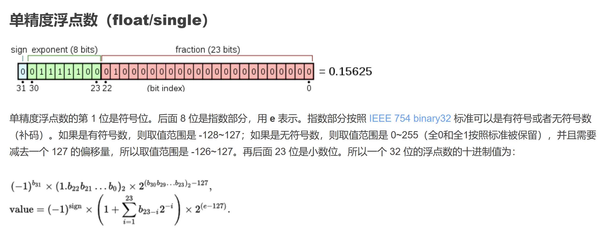
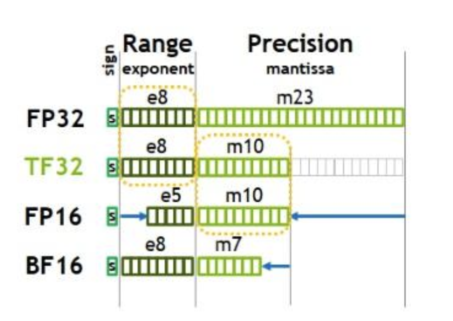

### 浮点数 floating point

https://qxsoftware.github.io/Float-Point-Number-Precision.html



- exponent 是有偏移量的，因为需要表示小于 1 的数
- fraction 部分的 1 是省略的，因为默认至少有一个 1


https://willendless.github.io/%E7%B3%BB%E7%BB%9F%E7%BC%96%E7%A8%8B/2021/05/30/csapp-ch2-2/ 

浮点数还分为规格化浮点数，非规格化浮点数，特殊值。（Section 2.1）

- 规格化浮点数（exp 非全 0 也非全 1），小数部分 M = 1+frac
- 非规格化浮点数（exp 全 0），小数部分 M = frac


### fp32, bf16, fp16, fp8 不同的数据类型

https://zhuanlan.zhihu.com/p/673708074 



fp8 分为两种 e4m3 和 e5m2 

bf16 比 fp16 的优势在于他的 exp 部分和 fp32 一样，所以数据表示范围（这里指的是 exp 的范围）一样，但是由于 precision 差一点，所以还是 fp32 会比 bf16 更强


random Jaccard
$$
\frac{pq}{p + q - pq}
$$


### torch 混合精度训练

这个 blog 写的还可以

https://bigfishtwo.github.io/posts/pytorch-amp/

pytorch 官方的文档

https://docs.pytorch.org/tutorials/recipes/recipes/amp_recipe.html#adding-torch-autocast 

总的来说，只需要在 forward 和 loss 计算的时候，用 autocast 包裹住即可。backward 的时候不用 autocase 包裹住

示例代码

```python
# Constructs a ``scaler`` once, at the beginning of the convergence run, using default arguments.
# If your network fails to converge with default ``GradScaler`` arguments, please file an issue.
# The same ``GradScaler`` instance should be used for the entire convergence run.
# If you perform multiple convergence runs in the same script, each run should use
# a dedicated fresh ``GradScaler`` instance. ``GradScaler`` instances are lightweight.
scaler = torch.amp.GradScaler("cuda")

for epoch in range(0): # 0 epochs, this section is for illustration only
    for input, target in zip(data, targets):
        with torch.autocast(device_type=device, dtype=torch.float16):
            output = net(input)
            loss = loss_fn(output, target)

        # Scales loss. Calls ``backward()`` on scaled loss to create scaled gradients.
        scaler.scale(loss).backward()

        # ``scaler.step()`` first unscales the gradients of the optimizer's assigned parameters.
        # If these gradients do not contain ``inf``s or ``NaN``s, optimizer.step() is then called,
        # otherwise, optimizer.step() is skipped.
        scaler.step(opt)

        # Updates the scale for next iteration.
        scaler.update()

        opt.zero_grad() # set_to_none=True here can modestly improve performance
```

虽然反向过程不被 autocast 包裹住，但是仍然还会有加速，这是因为

这是来自 GPT 的回答

> PyTorch 在内部做了两件事：
>
> 1. 它在计算图中**记录了每个张量的 dtype（FP16/BF16 vs FP32）**；
> 2. 反向传播时，autograd engine 会用**相同 dtype 的反向算子**（即如果 forward 的 matmul 是 FP16 Tensor Core，那么 backward 的 matmul 也用 FP16 Tensor Core）。

那么我们看 scalar，scalar 的作用是在 gradient 反传的过程中，scale up gradient 防止数值下溢。


## Three Quantization methods

### Dynamic Quantization
PyTorch 支持的最简单的量化方法称为动态量化。它不仅将权重转换为 int8（这是所有量化变体的共性），还会在计算前动态地将激活值转换为 int8（因此称为“动态”）。这样，计算将使用高效的 int8 矩阵乘法和卷积实现，从而加速计算。然而，激活值仍然以浮点格式读写内存。

> 我理解这是因为每个 linear 层的 scaling factor 不一样，让 activations 在不同层之间保持 FP32 能够保证尽可能小地被不同层之间的 scaling factor 影响

Pytorch 提供了一个[教程](https://pytorch.org/tutorials/advanced/dynamic_quantization_tutorial.html)

### Post-Training Static Quantization
通过将网络转换为使用整数运算和 int8 内存访问，静态量化可以进一步提高性能（降低延迟）。静态量化执行的额外步骤是，首先将数据批次输入网络并计算激活值的分布（具体来说，通过在不同位置插入“观察者”模块来记录这些分布）。这些信息用于确定在推理时如何量化不同的激活值（一个简单的方法是将激活范围划分为 256 个级别，但我们也支持更复杂的方法）。重要的是，这个额外的步骤使我们能够在操作之间传递量化值，而不是将这些值在每次操作之间转换为浮动数值，然后再转换回整数，从而显著提高速度。

> 这个和 Dynamic 的区别在于，这个相当于在层与层之间用 int8 保存 activation，而不是 FP32。这样确实会比 Dynamics 的效果要差，但是也确实更快。

在这个版本中，我们支持几种功能，允许用户优化他们的静态量化：

- **观察者（Observers）**：您可以自定义观察者模块，指定如何在量化前收集统计信息，尝试更先进的方法来量化您的数据。
- **操作融合（Operator fusion）**：您可以将多个操作融合成一个操作，从而节省内存访问并提高操作的数值准确性。
- **每通道量化（Per-channel quantization）**：我们可以独立量化卷积/线性层中每个输出通道的权重，这样可以在几乎相同的速度下提高准确性。

#### PyTorch API
- 要融合模块，可以使用 `torch.quantization.fuse_modules`。
- 观察者可以通过 `torch.quantization.prepare` 插入。
- 最后，量化本身可以通过 `torch.quantization.convert` 完成。

我们提供了一个端到端的量化示例教程（这个教程也涵盖了第三种量化方法——量化感知训练），但由于我们的 API 非常简单，执行训练后静态量化的三行代码如下：

```python
# 为服务器（x86）设置量化配置
deploymentmyModel.qconfig = torch.quantization.get_default_config('fbgemm')

# 插入观察者
torch.quantization.prepare(myModel, inplace=True)
# 校准模型并收集统计数据

# 转换为量化版本
torch.quantization.convert(myModel, inplace=True)
```

### Quantization-Aware Training
量化感知训练（QAT）是第三种方法，通常是这三种方法中准确度最高的。使用 QAT 时，所有权重和激活值在训练的正向和反向传递中都会“伪量化”：也就是说，浮动值会被四舍五入以模拟 int8 值，但所有计算仍然使用浮点数。因此，训练过程中所有的权重调整都在“意识到”模型最终会被量化的情况下进行；因此，经过量化后，这种方法通常比其他两种方法具有更高的准确性。

#### PyTorch API
- `torch.quantization.prepare_qat` 插入伪量化模块以进行模型量化。
- 模拟静态量化的 API，`torch.quantization.convert` 在训练完成后实际对模型进行量化。

例如，在端到端示例中，我们加载一个预训练模型为 `qat_model`，然后我们通过以下方式简单地执行量化感知训练：

```python
# 为 QAT 指定量化配置
qat_model.qconfig = torch.quantization.get_default_qat_qconfig('fbgemm')

# 准备 QAT
torch.quantization.prepare_qat(qat_model, inplace=True)

# 转换为量化版本，去除 dropout，检查每个 epoch 的准确性
quantized_model = torch.quantization.convert(qat_model.eval(), inplace=False)
```