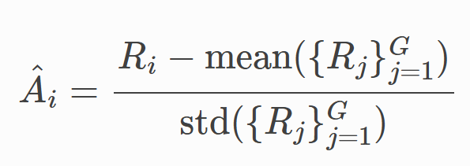
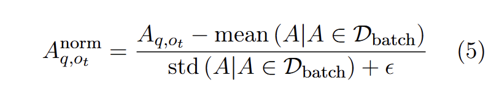
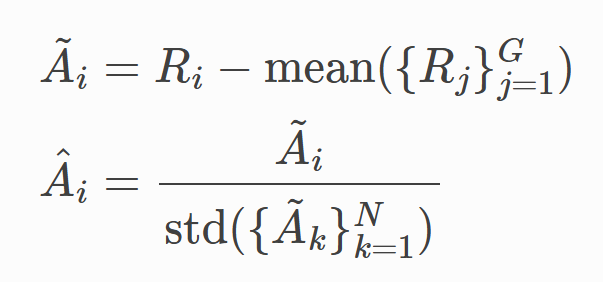
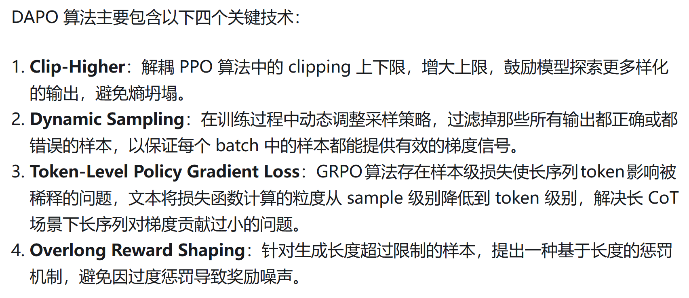

### 经典 reinforcement learning 算法

https://hrl.boyuai.com/chapter/2/dqn%E7%AE%97%E6%B3%95 

#### 分类

Value based 

- DQN, Double DQN, Duel DQN

Policy based

- REINFORCE, 

#### Value based

训练网络 $Q_w$ 目标网络 $Q_{w^-}$

DQN TD error target 相当于是用一个目标网络的最高 value 的动作的估值
$$
r + \gamma \max_{a'} Q_{w^-} (s', a')
$$
Double DQN TD error target 相当于把选取动作的东西变成了训练网络
$$
r + \gamma Q_{w^-} (s', \arg \max_{a'} Q_w(s', a'))
$$

#### Policy based

REINFORCE 
$$
\psi_t = \sum_{t'=t}^T \gamma^{t'-t} r_t \\

\theta \gets \theta + \alpha \sum_t^T \psi_t \nabla_\theta \log \pi_\theta (a_t | s_t)
$$
这里相当于是用这个轨迹上的每一步带 gamma 的 reward

#### Value and Policy base

Actor critic

在 REINFORCE 里边，使用 MC 的方式估计 $\psi_t$ 但是实际上可以用 

### REINFORCE++

快速学习一下这个算法。

主要区别是 advantage 的 scaling。GRPO 是用的组内均值和组内的标准差

REINFORCE++用的是全局均值和全局标准差

REINFORCE++ w/baseline 指的是 group-based 的版本

用的是组内均值和 batch 的方差

### DAPO

https://zhuanlan.zhihu.com/p/32368626065 

DAPO 在 GRPO 上增加了 4 个技术

这里第四个技术对应的是 overlong penalty buffer

第二个技术的具体实现是这样的

1. sample 一个 train batch，
2. 针对 train batch 里边的每一个 prompt 而言（注意这里一个 prompt 对应着 n 个 response），如果这个 train batch 里边的 filtered prompt 数量不足 train batch size，那么这个 step 不 gradient descent。到下一个 step ，用新的 train batch 继续生成 trajectory
3. 如果重复了 2 很多次还是不行，有一个 threshold，比如说 10 次，这个时候就强行用现有的 batch 做 gradient descent
4. 在步骤 3 里边可能遇到一个问题，如果 10 个 step 都没有 valid prompt。我们得 reset 所有，继续往下生成

> print(f"{x=}") 会 print 出来 x=$x 。很有趣，之前还不知道 python 有这样的语法

我看了一眼，好像没有 10 个 train step 都凑不齐的这种情况

### Entropy

$$
H(\pi_\theta, \mathcal{D}) = - \mathbb{E}_{x \sim \mathcal{D}, y \sim \pi_\theta(\cdot | x)} [\frac1{|y|} \sum_{t=1}^{|y|} \log \pi_\theta (y_t | y_{< t}, x )]
$$

Since we have $\pi_\theta (y_t | y_{< t}, x )  \in (0, 1)$ 

所以 $\log \pi_\theta (y_t | y_{< t}, x ) < 0$

Entropy collapse: entropy 越小，代表着概率越高，代表着 exploitation

Entropy explosion: entropy 越大，代表着概率越低，代表着 exploration

### Classic  RL 和 LLM RL 的符号对照表 backup

|  Variable Name  | Classical RL | LLM |
|  :--:  | :--:  |  :--:  |
| state | $s$ | $Q$ |
| action | $a$ | $Y = \{y_1, \cdots y_m\}$  |
| probability | $\pi_\theta(a |s)$ | $\Pi_{i=1}^m \pi_\theta (y_i | y_{j<i}, Q)$ |
| reward | $R(s, a)$ | $R(Q, Y)$ |

