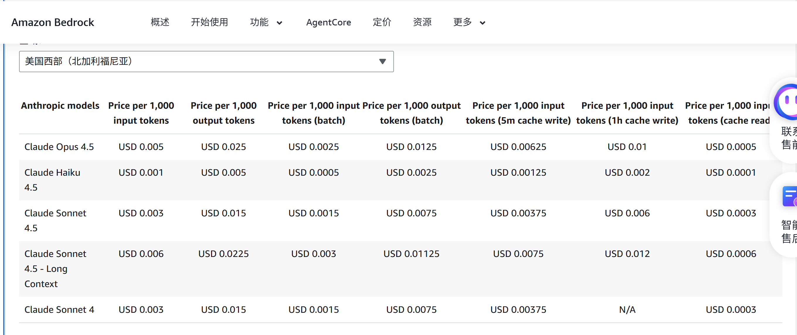

### Claude Code Permission

如果我想允许 claude code 的所有操作的，按时不允许 rm 操作，我可以这么配置文件


```json

{
  "permissions": {
    "allow": [
      "*"
    ],
    "deny": [],
    "ask": [
      "Bash(*rm *)",
      "Bash(*rmdir*)"
    ]
  }
}

```

如果想要是全局生效的话，我可以把这个文件放到

`~/.claude/settings.json` 


如果你在你的 folder 下边新从头开始执行 claude code 的话，要把上边这些东西放到 `settings.local.json` 文件里边去


### 用 amazon 的 credit 如何调用 claude code

一些基本的 setting


```
export AWS_ACCESS_KEY_ID=<your ID here>
export AWS_SECRET_ACCESS_KEY=<your key here>

export CLAUDE_CODE_USE_BEDROCK=1
export AWS_REGION=us-west-1
export ANTHROPIC_MODEL='us.anthropic.claude-haiku-4-5-20251001-v1:0'
export ANTHROPIC_SMALL_FAST_MODEL='us.anthropic.claude-haiku-4-5-20251001-v1:0'

export CLAUDE_CODE_MAX_OUTPUT_TOKENS=128000
export MAX_THINKING_TOKENS=32000
```

https://docs.aws.amazon.com/bedrock/latest/userguide/inference-profiles-support.html

这个 setup 好了的话，应该命令行就能正常用了。


#### 配置 vscode claude code

[在 VS Code 中使用 Claude Code - Claude Code Docs](https://code.claude.com/docs/zh-CN/vs-code)

简单来说，只需要在 `~/.claude/settings.json` 里边做配置就行了

把上边这些命令行的 args 写到 json 的 env 下边就行

```json
{
  "alwaysThinkingEnabled": true,
  "$schema": "https://json.schemastore.org/claude-code-settings.json",
  "env" :{
    "AWS_ACCESS_KEY_ID" : "<your ID here>",
    "AWS_SECRET_ACCESS_KEY" : "<your key here>",

    "CLAUDE_CODE_USE_BEDROCK": "1",
    "AWS_REGION": "us-west-1",

    "ANTHROPIC_MODEL": "us.anthropic.claude-haiku-4-5-20251001-v1:0",
    "ANTHROPIC_SMALL_FAST_MODEL": "us.anthropic.claude-haiku-4-5-20251001-v1:0",
    
    "CLAUDE_CODE_MAX_OUTPUT_TOKENS": "128000",
    "MAX_THINKING_TOKENS": "32000"
  }
}
```

这个东西的问题是换模型的话，得在 setting 里边改，没法 cli 或者 vscode extension 里边直接改了。


#### Amazon claude code pricing

[亚马逊基岩定价 — AWS](https://aws.amazon.com/cn/bedrock/pricing/)



haiku 是 0.001，sonnet 是 0.003，opus 是 0.005 。大概是这个价格区间


### Claude Code installation

安装 claude code

```bash
# Linux
curl -fsSL https://claude.ai/install.sh | bash

# Windows powershell
irm https://claude.ai/install.ps1 | iex
```


一些基本用法，

/init 让 claude read through 这个仓库的代码

/usage 监控 token usage。claude 有每天，每周，每月的限制


### 不同 Claude 模型

Claude模型按能力分为三个层级：

1. **Haiku**（俳句）- 最快速、最经济的模型
   - 适合简单任务、快速响应场景
   - 成本最低，速度最快
2. **Sonnet**（十四行诗）- 平衡型模型
   - 在能力和速度之间取得平衡
   - 适合大多数日常任务
3. **Opus**（交响乐）- 最强大的模型
   - 处理复杂任务能力最强
   - 推理和创造能力最出色
   - 成本较高，速度相对较慢


