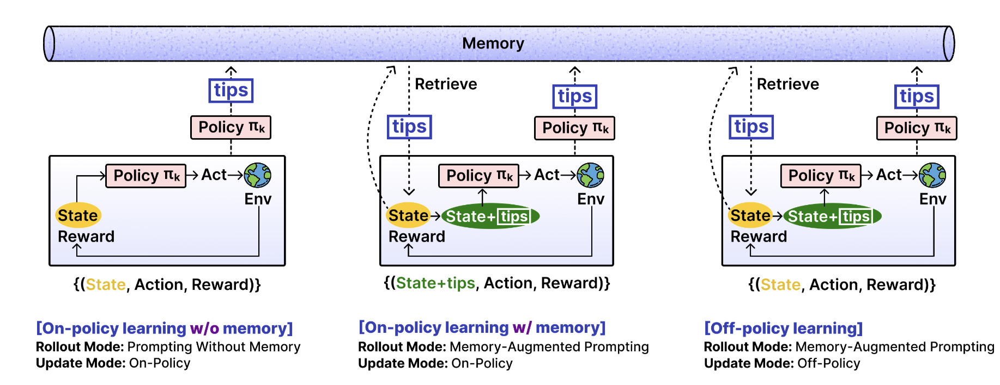

### Openrouter 监控还有多少余额

```python
import requests
import time
import json
import os

openrouter_key = ""

while True:
    response = requests.get(
      url="https://openrouter.ai/api/v1/key",
      headers={
        "Authorization": f"Bearer {openrouter_key}"
  }
)
    print(json.dumps(response.json(), indent=2))
    time.sleep(60)

```


### Openrouter 快速 setup

https://openrouter.ai/docs/quickstart 

openai SDK

```python
from openai import OpenAI

client = OpenAI(
  base_url="https://openrouter.ai/api/v1",
  api_key="<OPENROUTER_API_KEY>",
)

completion = client.chat.completions.create(
  extra_headers={
    "HTTP-Referer": "<YOUR_SITE_URL>", # Optional. Site URL for rankings on openrouter.ai.
    "X-Title": "<YOUR_SITE_NAME>", # Optional. Site title for rankings on openrouter.ai.
  },
  model="openai/gpt-4o",
  messages=[
    {
      "role": "user",
      "content": "What is the meaning of life?"
    }
  ]
)

print(completion.choices[0].message.content)
```


### API Provider Console

Claude

https://console.anthropic.com/workspaces/default/cost 


OpenAI 

https://platform.openai.com/usage 


Gemini

这个还没付钱，应该先不用管


### Papers

EMPO2: Exploratory Memory-Augmented LLM Agent via Hybrid On- and Off-Policy Optimization 

https://openreview.net/forum?id=UOzxviKVFO 

相当于在每一个 task rollout 结束的时候，agent 自己生成一个 tips。之后的 rollouts 是 tips augment generation. 




### OpanAI API 平台

控制台

https://platform.openai.com/settings/organization/api-keys 


