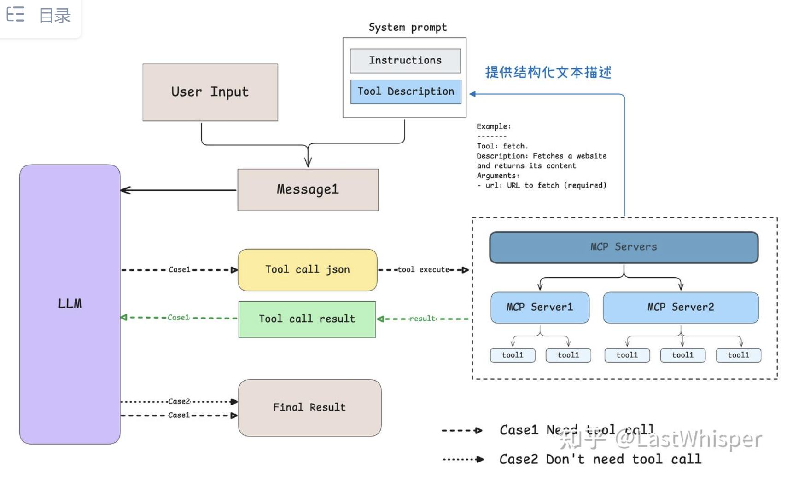
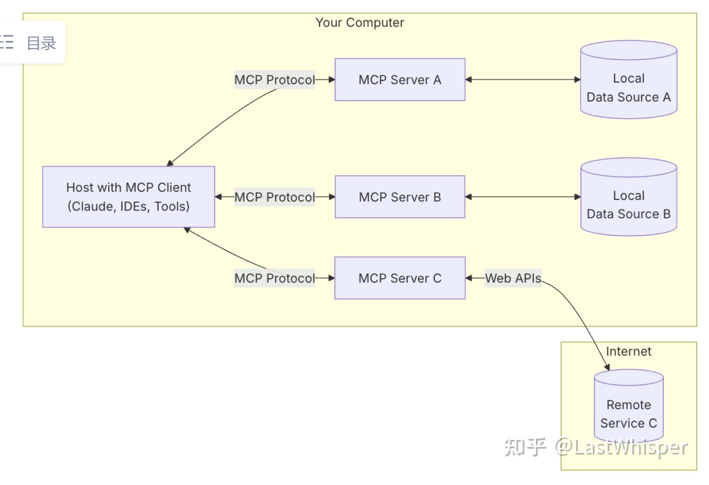

### MCP: Model Context Protocol

> 学这个是因为要在 gpt oss 上搭 tool call，然后发现我完全不了解现在的 MCP 工具是怎么搞的

https://modelcontextprotocol.io/docs/getting-started/intro

这个应该是原始的 MCP 的 docs

我看的是这个知乎上边的

https://zhuanlan.zhihu.com/p/29001189476 

https://github.com/punkpeye/awesome-mcp-servers/blob/main/README-zh.md 

这里有一堆 MCP 的实现，但是还不知道是什么东西

可以看到 MCP server 似乎是一个集成 tool 的工具

#### MCP Host, Client, Server

区分一下 MCP host，client，server 的实现。可以这么理解

- host 只有一个
- host 在需要的时候可以起很多 client，这个相当于是子进程或者子线程的概念
- server 相当于是资源，可以被 client 调用

> 但是看起来 MCP 只是一个 functional call 的治理工具。

