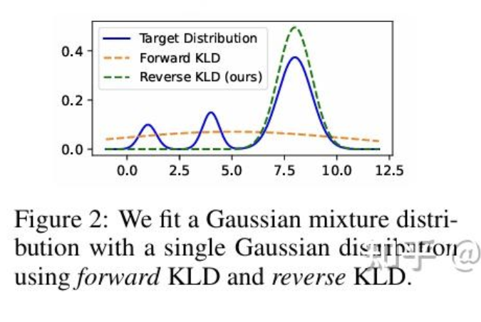

KL 的定义

$$
D_{\mathrm{KL}}(P \| Q) = \sum_x P(x) \log \frac{P(x)}{Q(x)}
$$

Forward KL 和 Reverse KL

https://zhuanlan.zhihu.com/p/690748958

这个一开始是从 knowledge distillation 里边出来的，假设我们有一个 teacher 分布 P 和要学的 student 分布 $Q_\theta$ 

Forward KL
$$
\arg \min_\theta \mathrm{KL}(P \| Q_\theta) = \arg \min_\theta \sum_x P(x) \log \frac{P(x)}{Q_\theta(x)}
$$

Reverse KL
$$
\arg \min_\theta \mathrm{KL}(Q_\theta \| P) = \arg \min_\theta \sum_x Q_\theta(x) \log \frac{Q_\theta(x)}{P(x)}
$$

其实一张图就能理解

forwad KL 的好处是能够兼顾多个峰；reverse KL 的好处是能够拟合到最大的峰上边去

实际上，如果经过了 200 epoche 之后，forward KL 和 backward KL 都能够拟合最终的 distribution，只是拟合过程中 forward 有限拟合 mass 重的地方，reverse KL 有限拟合 tail

