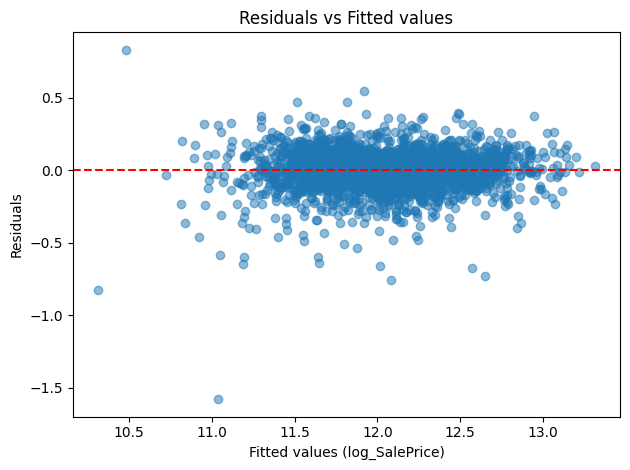
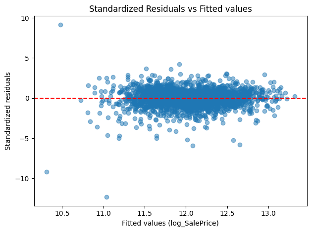
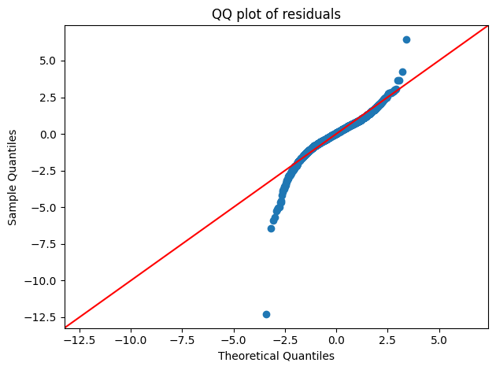

> 一些统计学的知识

### 一些名词

- nominal 名义变量，没有顺序

- ordinal 顺序变量，有顺序

- discrete

- continuous

OLS Ordinary Least Squares Regression 最小二乘回归

### $R^2$ R-Square

$$
R^2 = 1 - \frac{SSR}{SST} \\
SSR = \sum_{i=1}^n (y_i - \hat{y}_i)^2 \\
SST = \sum_{i=1}^n (y_i - \bar{y}_i)^2
$$

R2 约接近 1，说明模型越能预测完美的数据

R2 越小，说明模型不能解释数据的波动

### 回归分析

首先我们要画 Reidual 和 fitted value 的曲线，以及 Standardized Residual 和 fitted value 的曲线

Residual 这个很好理解，就是 $y_i = \hat{y}_i$ 。横轴是 $\hat{y}$ 的值的分布。就是说看不同 $\hat{y}$ 下边 residual 的变化情况

Standardize residual 是对 residual 做一个了什么操作。这个我没看懂。这个是真不会

QQ 图。这个东西主要是衡量残差 residual 是否符合正态分布。具体的操作是画一个分位数的曲线，如果点都在 45° 的线上，说明 residual 很接近正态分布

