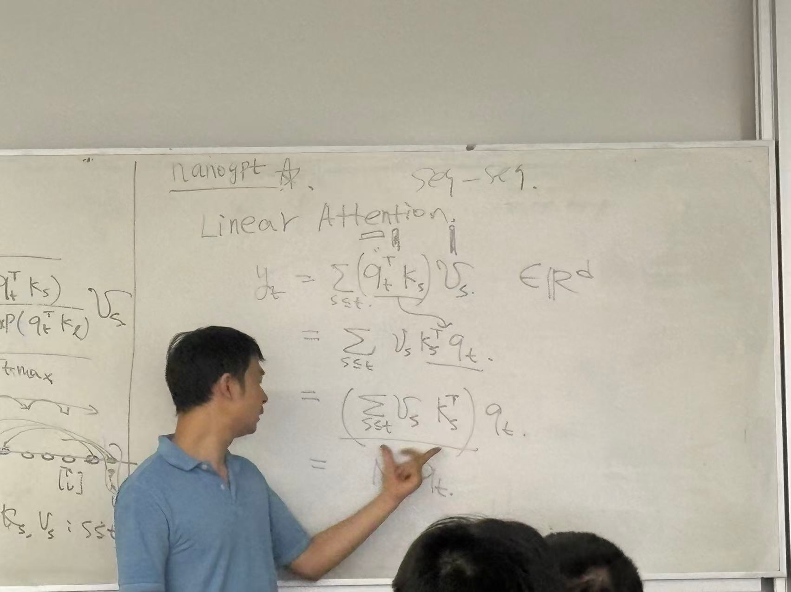
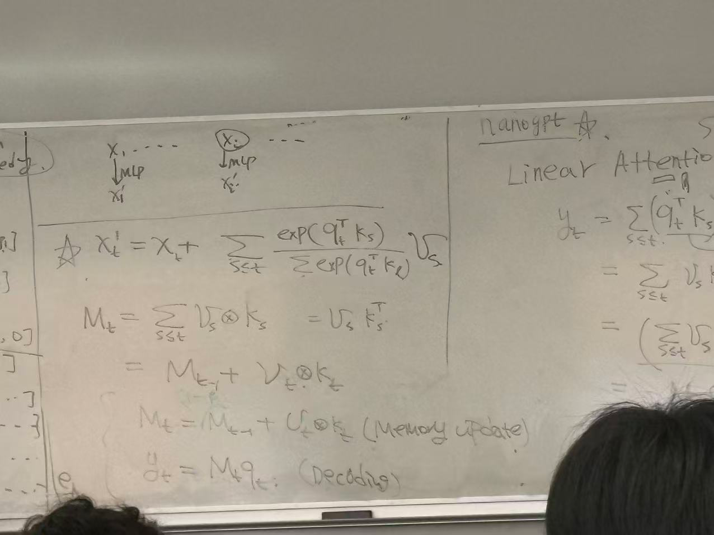
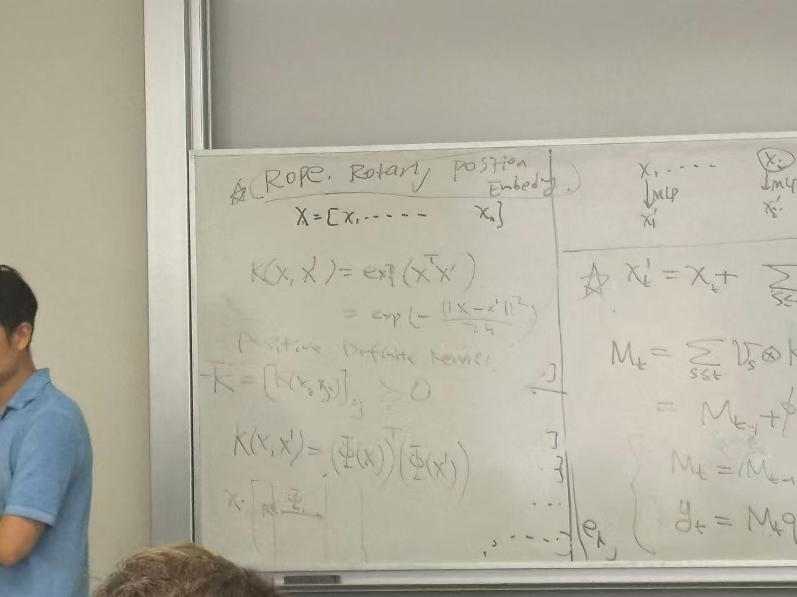

## Adv in Generative Model

> Prof Qiang Liu, 2025 Fall

### Optimizer: Adam, AdamW, SGD

#### Adam

Adam 的公式
$$
\theta_n = \theta_{n-1} - lr \cdot (\frac{\hat{m}_n}{\sqrt{\hat{v}_n} + \epsilon})
$$

$$
\hat{m}_n = m / (1 - \beta_1^{n}) \\
\hat{v}_n = n / (1 - \beta_2^{n})
$$

where we have
$$
g_n = \nabla_\theta f(\theta_{n-1}) \\
m_n = \beta_1 m_{n-1} + (1 - \beta_1) g_n  \\
v_n = \beta_2 v_{n-1} + (1 - \beta_2) g_n^2 \\
$$
除法的 $1 - \beta_1^{n}$ 是 normalization factor

Adam with weight decay

在 Adam 的 case 下实现 weight decay，是在 gradient 加上 regularization
$$
g_n = g_n + \lambda \theta_{n-1}
$$

> 这样的话，做积分相当于就是 $\ell_2$ regularization
> $$
> \mathrm{Loss} = \int \nabla_\theta f(\theta_{t-1}) + \lambda \theta_{t-1} = f(\theta_{t-1}) + \frac12 \lambda \theta_{t-1}
> $$

加上 regularization 之后再算一阶 momentum 和二阶 momentum，相当于
$$
m_n = \beta_1 m_{n-1} + (1 - \beta_1) (g_n - \lambda \theta_{n-1})  \\
v_n = \beta_2 v_{n-1} + (1 - \beta_2) (g_n - \lambda \theta_{n-1})^2 \\
$$

#### AdamW

AdamW 的实现在于，正常算 $m_n, v_n$ 只不过在最终 optimizer step 的时候，真正把 weight decay 加上去
$$
\theta_n = \theta_{n-1} - lr \cdot (\frac{\hat{m}_n}{\sqrt{\hat{v}_n} + \epsilon} + \lambda \theta_{t-1})
$$

#### Lion

苏剑林的 blog

https://zhuanlan.zhihu.com/p/610262893 
$$
m_n = \beta_1 m_{n-1} + (1 - \beta_1) g_n \\
\theta_n = \theta_{n-1} - lr \cdot (\mathrm{sign} (\beta_2 m_n + (1 - \beta_2) g_n) + \lambda \theta_{n-1})
$$
这个其实是集成了 signSGD 的思想。参数更新的时候只关注方向，不关注大小

### Muon

苏剑林的 blog

https://zhuanlan.zhihu.com/p/13401683661 

### Linear Attention

linear attention 和 full attention 的区别

linear attention 本质上把 Softmax 扔掉了，其实本质上是把 exp 项扔掉了。

这样的话可以通过 rearrange 顺序，把 $\sum v_s k_s^\top$ 单独抽出来，变成一个固定的matrix，这个 matrix 可以被理解为是 model 的memory

所以这个东西本质上就是 SSM state space model。State Space Model 分为两个步骤，memory update 和 decoding。核心 design 的想法变得很清晰了

可以从另外一个角度理解 linear attention。本质上 exp 是一个 non-linear function 。如果从 kernel method 的角度来讲，exp 相当于是把 x map 到一个 infinite dimension space之后，再做 inner product。

在 linear attention 里边，也可以往 $q \cdot k^\top$ 上加 kernel method，这就等价于一个 mapping。如果要实现和 exp exact match 的效果，需要 mapping 到 infinite dimension，但是实际上做不到这一点。

