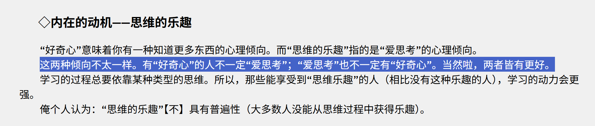
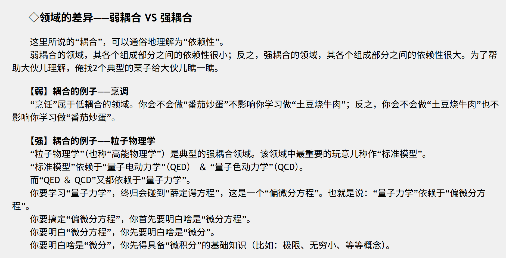
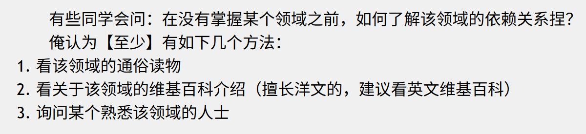
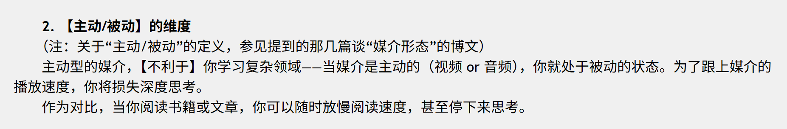
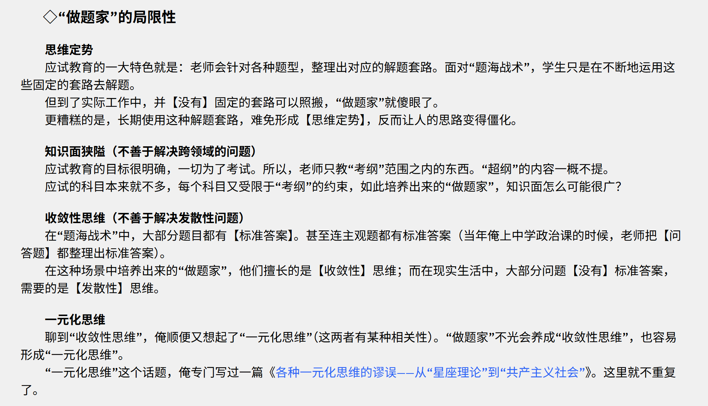
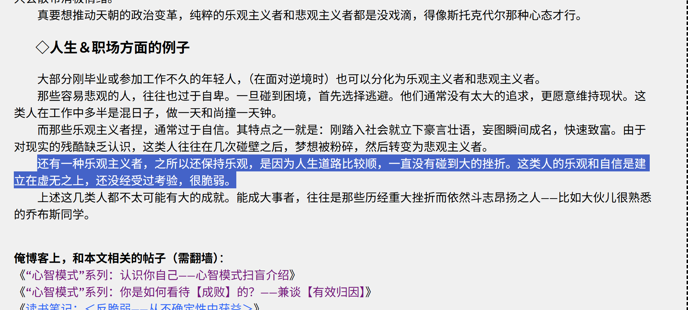

### 编程随想阅读笔记

### 我最需要的东西

20260207

我现在需要学习的东西太多太多了，我现在生活很乱，我现在有太多东西需要学了，就是首先我需要学会如何阅读别人的材料，然后我还需要学会如何整理每天学到的知识。

从开始学习阅读开始，从现在开始，我的阅读需要不断反思下边几个问题

[《如何阅读一本书》——书评及内容纲要 @ 编程随想的博客](https://program-think.blogspot.com/2013/04/how-to-read-book.html)

这本书在谈些什么

- 种类，主题，分类。用最简短的句子概括这个书到底说了什么

诠释这本书的内容

- 通过重要的。词汇，句子和内容，和作者达成共识
- 从重要的句子里找出作者的主旨。

评价这本书

- 看这个作者的论述哪里有些谬误。

主题阅读：

1. 找到和这个书籍相关主题的书籍，继续阅读
2. 找到这些主题的书籍他们共同在讨论什么问题？这些问题是不是不同的人有不同的观点。如果是的话那为什么他们观点是不一样的？

20260206

我现在的生活很差劲

我现在每天要熬夜到两三点才能睡觉，早上醒了之后不想起来，因为不想面对每天很痛苦但是又不知道该怎么解决的生活。

我只想拿一个 phd 学位，我不想为之努力。我想每天躺着，吃好吃的，打网球，然后再和朋友扯扯淡吹牛逼。我不想做什么 research。但是我还喜欢钱，我想赚钱，我想去世界旅游。如果这个世界上有一件事情我最不想干，那就是搞科研

我不想要搞科研，但是我很想要科研成功之后给我带来的成就。

第二优先级是，我现在不会利用身边的人，我需要把他们身上的能力和技术为我所用，变成我自身的收益或者能力。我不知道改怎么劝说他们为我所用。我需要一套分析和控制身边的人的框架，把他们都变成我的工具，为我所用。

第三优先级是，我需要想明白我这辈子想干什么事情，更深层就意味着我需要找到我的爱好，或者是我的使命。

#### TODO list

[什么是【真正的】兴趣爱好？以及它有啥好处？ @ 编程随想的博客](https://program-think.blogspot.com/2015/12/Hobbies-and-Interests.html)

[为啥俺很少看视频？——兼谈“视频”与“文本”在认知心理学方面的差异 @ 编程随想的博客](https://program-think.blogspot.com/2017/08/Some-Reasons-to-Watch-Less-Videos.html)

[为啥俺不常用微博？——兼谈时间管理心得 @ 编程随想的博客](https://program-think.blogspot.com/2012/02/microblog-and-time-management.html)

[“传统博客”过时了吗？——兼谈各种媒介形态的优缺点 @ 编程随想的博客](https://program-think.blogspot.com/2015/02/Is-Blogging-Dead.html)

学习一个复杂耦合的领域，需要系统性的学习，下边这个是 prioritize 的

[如何【系统性学习】——从“媒介形态”聊到“DIKW 模型” @ 编程随想的博客](https://program-think.blogspot.com/2019/10/Systematic-Learning.html)

我能够理解为什么费曼学习法是一种两个人的博弈，但是我不能理解为什么回复别人的傻逼评论也是对自己有利的？

[博弈论入门教程——从基本概念到具体案例 @ 编程随想的博客](https://program-think.blogspot.com/2020/11/Game-Theory.html)

这个我感觉我很需要，因为我觉得只是真的是太多了。我其实不知道我真正需要学的是哪些

[如何完善自己的知识结构 @ 编程随想的博客](https://program-think.blogspot.com/2013/09/knowledge-structure.html)

做题家的思维都是收敛和固定的，这就容易产生一元化思维。我归纳觉我是这种，但是我大概知道这个的坏处是思维僵化，但是还有什么别的坏处呢？以及我应该要怎么破解呢？我不知道

[各种【一元化思维】的谬误——从“星座理论”到“共产主义社会” @ 编程随想的博客](https://program-think.blogspot.com/2014/09/oversimplification.html)

#### Reading Notes

[学习与人生——700篇博文之感悟 @ 编程随想的博客](https://program-think.blogspot.com/2020/12/Study-and-Life.html)

自学

实践

自律

成长（能力跃迁之前必然经历低谷）

时间（二阶导大于零的能力增长）

人生（跳出 996 的怪圈，提高能力来增强自己的议价资本）

学习的内在动力是 好奇心 + 爱思考。两者兼备能够让你学习的很好

要开始自学，首先要认清你学的究竟是一个什么东西

你自学的领域会分为强耦合和弱耦合

学习一个领域的第一步就必须要了解其中的依赖关系，学习依赖关系

学习还要分为主动和被动：

当媒介是主动的，比如说视频或者音频，你就是被动的，当媒介是被动的，才能让你思考，才是主动学习

做题家的一元化思维

关于自律，这是我现在最需要的东西，我不能继续靠我的意志力来自律了。这样终究会把我的意志力耗尽的

[“心智模式”系列：如何面对【逆境】？——兼谈“斯托克代尔悖论” @ 编程随想的博客](https://program-think.blogspot.com/2012/01/stockdale-paradox.html)

最终能够成事的人，满足这个条件

- 战略上乐观；战术上悲观

显然我现在是一个这里的悲观主义者，认为自己未来不会成大事，拼命想要维持现状。但是我越是这么做，就越不可能维持现状。

