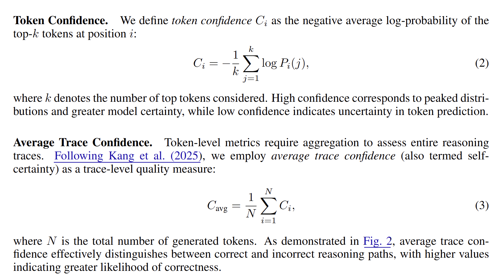

### deepconf

https://github.com/facebookresearch/deepconf

https://arxiv.org/pdf/2508.15260

The definition of entropy is given as follows:

$$
H(x) = -\sum_{i} p(x_i) \log p(x_i)
$$

The definition of condidence is given as follows:

$$
C_i = - \frac1k \sum_{i=1}^k \log p(x_i)
$$

They have two differneces:

1. It uses **$- \sum \log p(x_i)$** instead of $- \sum p(x_i) \log p(x_i)$

2. It **only calcualte on top-k tokens** instead of all tokens.

Now, let's consider how confidence will be affected by the distribution of top-k token probabilities. 

**Step 1:** decompose confidence into two parts: 

$S_k = \sum_{i=1}^k \log p(x_i)$: the coverage of top-k tokens, which reflects how much probability mass within the top-k regions. 

$q(x_i) = p(x_i) / S_k$: the normalized distribution of top-k tokens, which reflects how the probability mass is distributed within the top-k regions.

We can rewrite confidence as follows:

$$
\begin{aligned}
C_i = - \frac1k \sum_{i=1}^k \log p(x_i)
= - \frac1k \sum_{i=1}^k \log (q(x_i) S_k)
= - \underbrace{\frac1k \sum_{i=1}^k \log q(x_i)}_{\text{inner}}
  - \underbrace{\log S_k}_{\text{coverage}}
\end{aligned}
$$

Therefore, to maximize the confidence, is equal to either (i) **increase the coverage of top-k tokens**, or (ii) **make the distribution of top-k tokens more sharp**.

Regarding to the length of the trace, the author actually take average over the token confidence to have the trace confidence, 

$$
C_{\mathrm{avg}} = \frac1n \sum_{i=1}^n C_i
$$

So longer trace will not have lower confidence score. 

