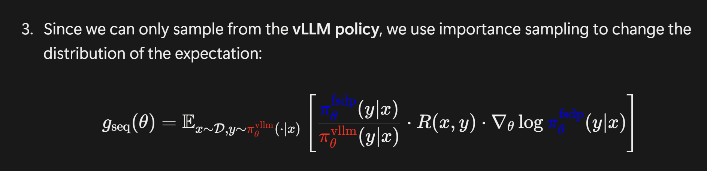
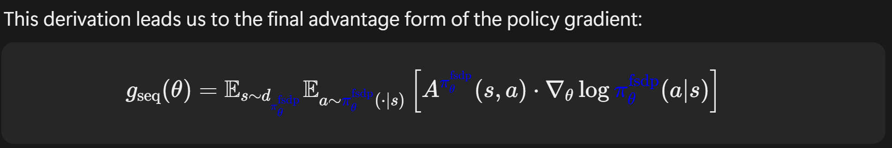
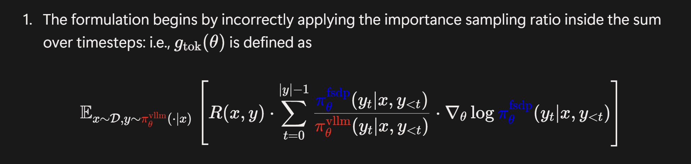
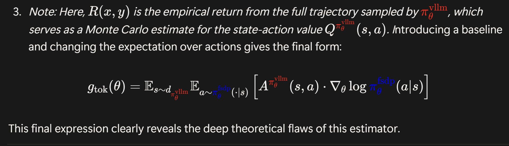
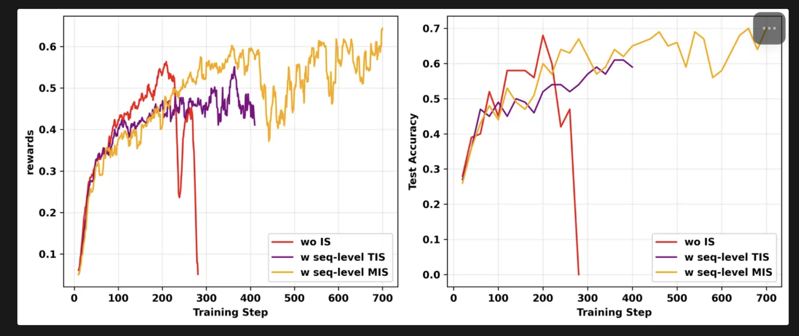

### Importance sampling in verl

notion blog

https://yingru.notion.site/When-Speed-Kills-Stability-Demystifying-RL-Collapse-from-the-Training-Inference-Mismatch-271211a558b7808d8b12d403fd15edda 

verl PR:

https://github.com/volcengine/verl/pull/3694 

#### $g_{\mathrm{seq}}$ 和 $g_{\mathrm{tok}}$ 的区别

$g_{\mathrm{seq}}$ 和 $g_{\mathrm{tok}}$ 的区别在于一个 important ratio ，seq 是用整个序列的 probability 来计算的，

seq 通过推导最终能够实现

而 tok 是用 summation 来计算的

但是 tok 最终只能实现

这里有两点不一样，

1. state occupancy 不一样
2. advantage function 不一样

$g_{\mathrm{seq}}$ 是 ground truth gradient，但是 $g_{\mathrm{tok}}$ 从上述两个地方不一样

#### TIS 和 MIS 的区别

TIS 是 truncated importance sampling

MIS 是 masked importance sampling

相当于把这里的 importance ratio 做 turncated

这里和 PPO 的 truncate 不一样，ppo 里边的 truncated 会导致 gradient 直接变为 0，但是这里的 truncated 不会。因为后边的 R （或者是 advantage function）里边仍然会有梯度

从实验结果上来看 ，seq level 的 MIS 是最好的 combination

- seq level > tok level 这个有理论支撑
-  MIS > TIS 这个只有实验支撑，没有理论支撑。tok level 的 TIS 和 MIS 区别不知道

因此，现有最强的组合是 seq + MIS

还有一个东西是 geometry IS，但是不知道这个东西有多强

