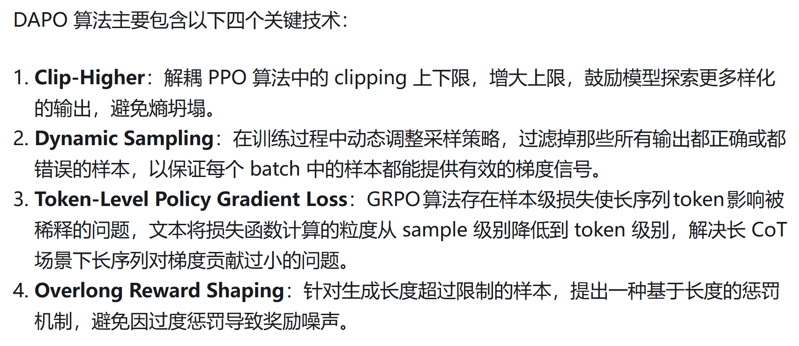

### DAPO

https://zhuanlan.zhihu.com/p/32368626065 

DAPO 在 GRPO 上增加了 4 个技术

这里第四个技术对应的是 overlong penalty buffer

第二个技术的具体实现是这样的

1. sample 一个 train batch，
2. 针对 train batch 里边的每一个 prompt 而言（注意这里一个 prompt 对应着 n 个 response），如果这个 train batch 里边的 filtered prompt 数量不足 train batch size，那么这个 step 不 gradient descent。到下一个 step ，用新的 train batch 继续生成 trajectory
3. 如果重复了 2 很多次还是不行，有一个 threshold，比如说 10 次，这个时候就强行用现有的 batch 做 gradient descent
4. 在步骤 3 里边可能遇到一个问题，如果 10 个 step 都没有 valid prompt。我们得 reset 所有，继续往下生成

> print(f"{x=}") 会 print 出来 x=$x 。很有趣，之前还不知道 python 有这样的语法

我看了一眼，好像没有 10 个 train step 都凑不齐的这种情况

### Entropy

$$
H(\pi_\theta, \mathcal{D}) = - \mathbb{E}_{x \sim \mathcal{D}, y \sim \pi_\theta(\cdot | x)} [\frac1{|y|} \sum_{t=1}^{|y|} \log \pi_\theta (y_t | y_{< t}, x )]
$$

Since we have $\pi_\theta (y_t | y_{< t}, x )  \in (0, 1)$ 

所以 $\log \pi_\theta (y_t | y_{< t}, x ) < 0$

Entropy collapse: entropy 越小，代表着概率越高，代表着 exploitation

Entropy explosion: entropy 越大，代表着概率越低，代表着 exploration

