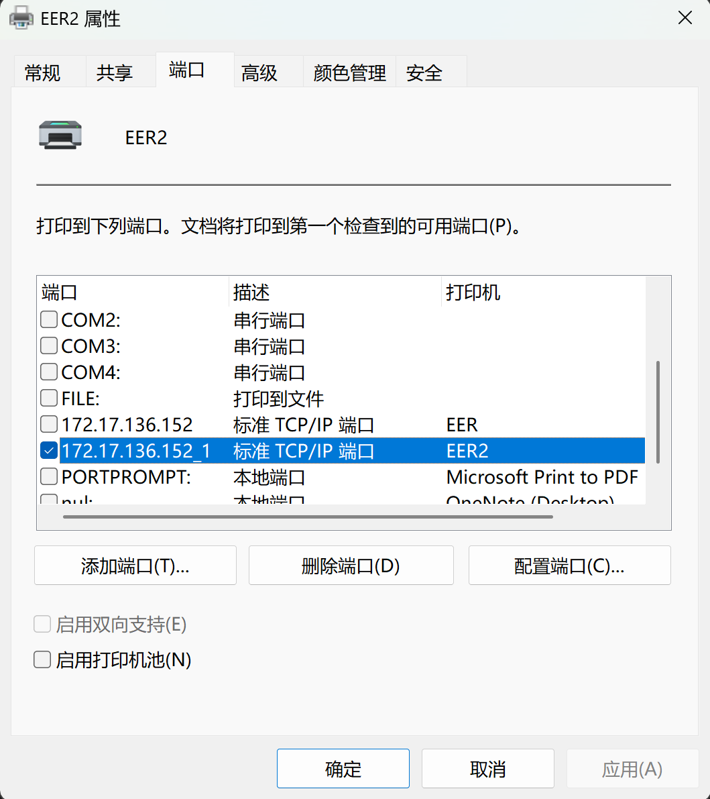
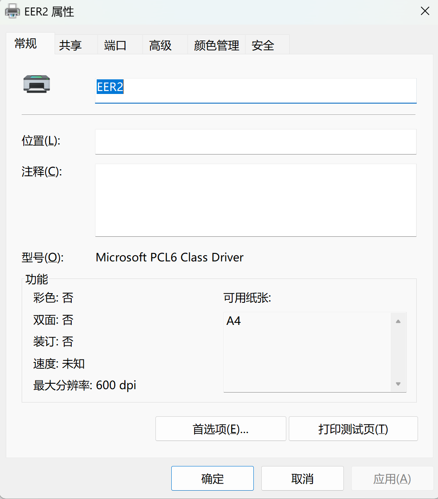
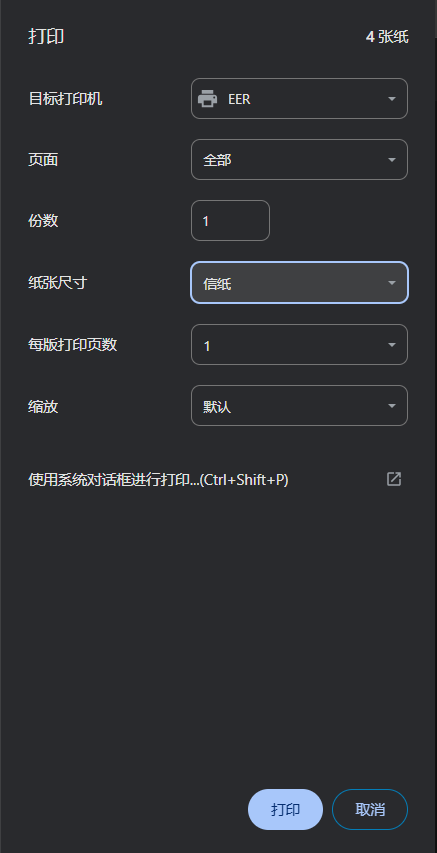

### Travel Reimbursement

到这个 request form 的地方，在 travel 之前要交一个 request 

travel 之后要交一个 reimbursement request

每天的 meal 有 51 刀的额度，剩下的都需要 receipt 才能报销

https://utdirect.utexas.edu/apps/services/requests/

### UT EER Printer

GDC 的 printer 没法用 windows 的电脑链接，所以只能去EER 7 楼的 printer

要用 IP 地址添加 printer 

172.17.136.152 

要选 TCP/IP printer，端口和 IP 地址一样就行

drive 的型号要选 Microsoft PCL6 ，不能选 text only，否则 pdf 打出来是乱码

打印的纸张要选美国信纸（Mac），在 Windows 下边要选 信纸

如果文件过大的话，可能会卡死。但是取消任务之后却又能打印出来，不知道咋回事。这个可以等之后有时间再解决一下