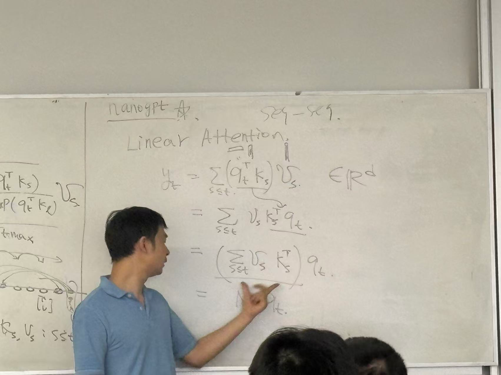
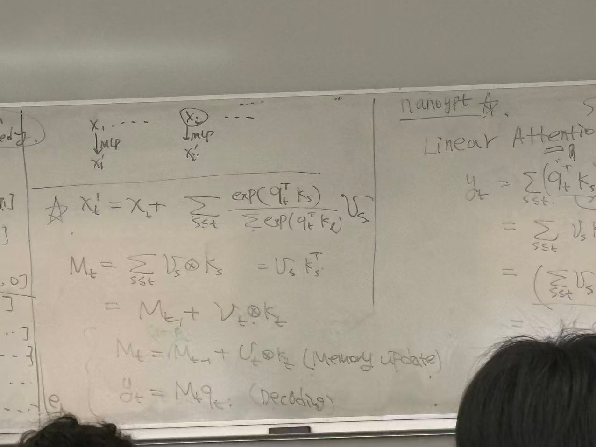
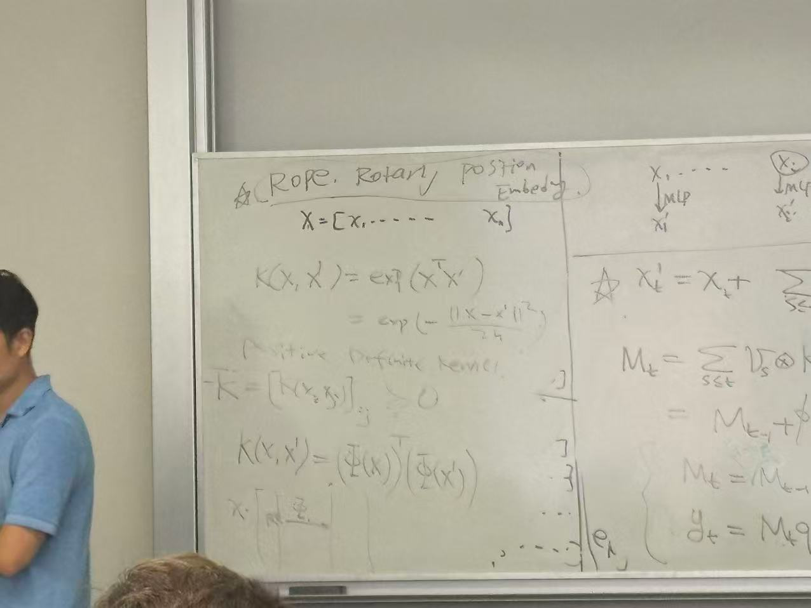

### Adv in Generative Model

> Prof Qiang Liu, 2025 Fall

linear attention 和 full attention 的区别

linear attention 本质上把 Softmax 扔掉了，其实本质上是把 exp 项扔掉了。

这样的话可以通过 rearrange 顺序，把 $\sum v_s k_s^\top$ 单独抽出来，变成一个固定的matrix，这个 matrix 可以被理解为是 model 的memory

所以这个东西本质上就是 SSM state space model。State Space Model 分为两个步骤，memory update 和 decoding。核心 design 的想法变得很清晰了

可以从另外一个角度理解 linear attention。本质上 exp 是一个 non-linear function 。如果从 kernel method 的角度来讲，exp 相当于是把 x map 到一个 infinite dimension space之后，再做 inner product。

在 linear attention 里边，也可以往 $q \cdot k^\top$ 上加 kernel method，这就等价于一个 mapping。如果要实现和 exp exact match 的效果，需要 mapping 到 infinite dimension，但是实际上做不到这一点。

