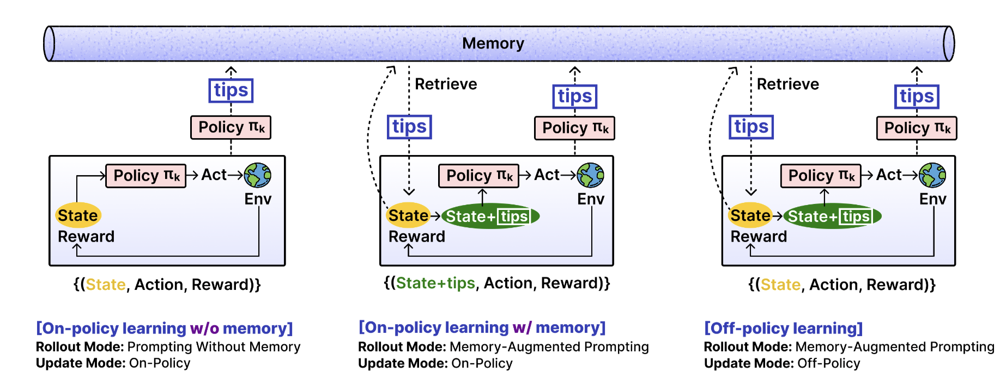

### Openrouter 监控还有多少余额

```python
import requests
import json
import os
import dotenv
dotenv.load_dotenv()
response = requests.get(
  url="https://openrouter.ai/api/v1/key",
  headers={
    "Authorization": f"Bearer {os.getenv('OPENROUTER_API_KEY')}"
  }
)
print(json.dumps(response.json(), indent=2))
```


### API Provider Console

Claude

https://console.anthropic.com/workspaces/default/cost 


OpenAI 

https://platform.openai.com/usage 


Gemini

这个还没付钱，应该先不用管


### Papers

EMPO2: Exploratory Memory-Augmented LLM Agent via Hybrid On- and Off-Policy Optimization 

https://openreview.net/forum?id=UOzxviKVFO 

相当于在每一个 task rollout 结束的时候，agent 自己生成一个 tips。之后的 rollouts 是 tips augment generation. 




### OpanAI API 平台

控制台

https://platform.openai.com/settings/organization/api-keys 


