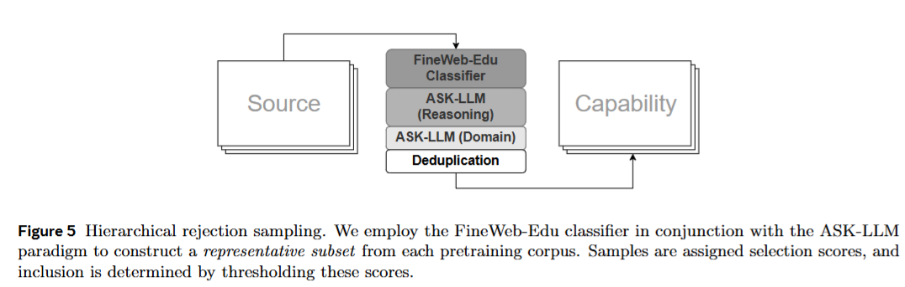
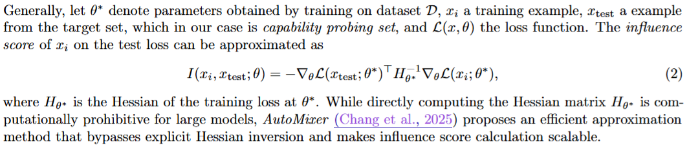

### Mobile LLM R1

https://arxiv.org/pdf/2509.24945

用高质量数据集训小模

#### pretraining

在 pretraining 阶段，他们会把数据集用自动打分的方式进行分类

大致分为 4 步。首先用 fineweb edu 去掉教育价值低的内容。然后用 ASK-LLM 过滤出那些需要推理的 sample，接着进行不同 domain 的分类。最后进行去重。

这里还做了一个 Leave one out 的分析。也就是逐个去除数据集，看模型的表现。由此来发现那个数据集对模型表现的贡献最大

除此之外，他们还对于每一个用于训练的样本都进行了选择。具体来说，他们算了一个 self influence score

这个有点 nb，这个 GPT 能推导出来。我看明白了。等有时间写一下吧。

#### Mid training

mid training 主要是两步。把 data 换成更加 reasoning heavy 的data，以及开始做 distillation

