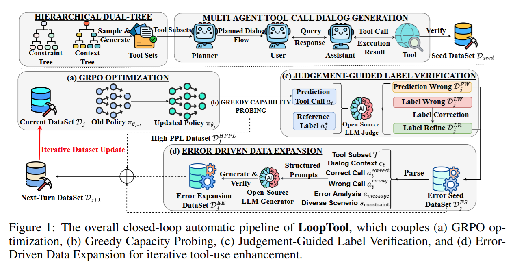

## LLM for tool-call

> Zhizhou: Depreacated at 2025/12/15
>
> 这里的东西都没用了

### Ideas

#### Direction1: Noisy Tool and fix it

把 setting 设置在 tool 有可能出错这个前提下

Tools Fail (EMNLP 2024)

https://arxiv.org/pdf/2406.19228 

这个也得看一下

**Benchmarking Failures in Tool-Augmented Language Models (NAACL 2025)**

https://arxiv.org/pdf/2503.14227

**On the Robustness of Agentic Function Calling (Trust NLP ACL 2025)**

https://aclanthology.org/2025.trustnlp-main.20.pdf

这个是假设了 tool 的结果是正确的，只不过调用的时候会被混淆。这个是在 BFCL 上做的。只 release 了 dataset

https://huggingface.co/datasets/ibm-research/BFCL-FC-robustness 

这个 paper 做了两个改进，测试 tool 的鲁棒性

1 paraphrase user 的 query，变得更奇怪；2 增加很多看起来一样，但是用处完全不一样的工具。（具体来说，他们生成新工具的方法是：首先生成这个领域内的一些其他相关，但是和原问题不一样的问题；再给这些问题生成一些工具，作为混淆模型的新工具）

#### Direction2: Limit resource

第二个 direction 是 resource limit tool calling。有限的预算

Plan and Budget: Effective and Efficient Test-Time Scaling on Large Language Model Reasoning 

https://arxiv.org/pdf/2505.16122 

LLM reasoning 上的 budge planning

### Benchmark

先看一下 benchmark 具体都是在做什么

BFCL: Berkeley Function Calling Leaderboard

paper: https://openreview.net/pdf?id=2GmDdhBdDk 

codebase: https://github.com/ShishirPatil/gorilla/tree/main/berkeley-function-call-leaderboard

live leaderboard: https://gorilla.cs.berkeley.edu/leaderboard.html#leaderboard 

ACEBench

paper: https://arxiv.org/pdf/2501.12851 

codebase: https://github.com/chenchen0103/ACEBench/ 

### Training Free Method

两个 2023 年的工作

self-refine, reflexion

Training-free GRPO

https://arxiv.org/pdf/2510.08191 

openreview form: https://openreview.net/forum?id=tyUnYbE7Gi Score: 2246

这个被 reviewer complain 和 self-refine 很像

codebase: https://github.com/TencentCloudADP/youtu-agent/tree/training_free_GRPO 

这个用了两个 benchmark

1 math-reasoning 用的是 AIME24 和 AIME25; 2 Web search 这个用的是 Web walker

Agent KB 

https://arxiv.org/pdf/2507.06229 

这个相当于把 experience 变成知识图谱了，感觉有点复杂

FLEX: Continuous Agent Evolution via Forward Learning from Experience 

https://arxiv.org/pdf/2511.06449 

codebase: https://github.com/GenSI-THUAIR/FLEX (Not released)

这里加了一个经验的提纯，用了一个什么 meta MDP 的东西，来更新经验。但是具体的操作还得仔细看看代码

这个 paper 用了三个 benchmark

1 GSM8K 2 USPTO-50 (一个化学任务，给最终的产物，向前逆合成 1 步) 3 ProteinGym (预测蛋白质突变之后的功效)

### Tool Related Method Paper

LoopTool

https://arxiv.org/pdf/2511.09148 

这个是一个自动化数据增强的 pipeline。

从 (b) 开始，第一步是选出 High Perplexity 的 data；(c) Opensource model 分析来做错误分析和数据集的 correction；(d) 根据错误的类型继续 extend dataset

