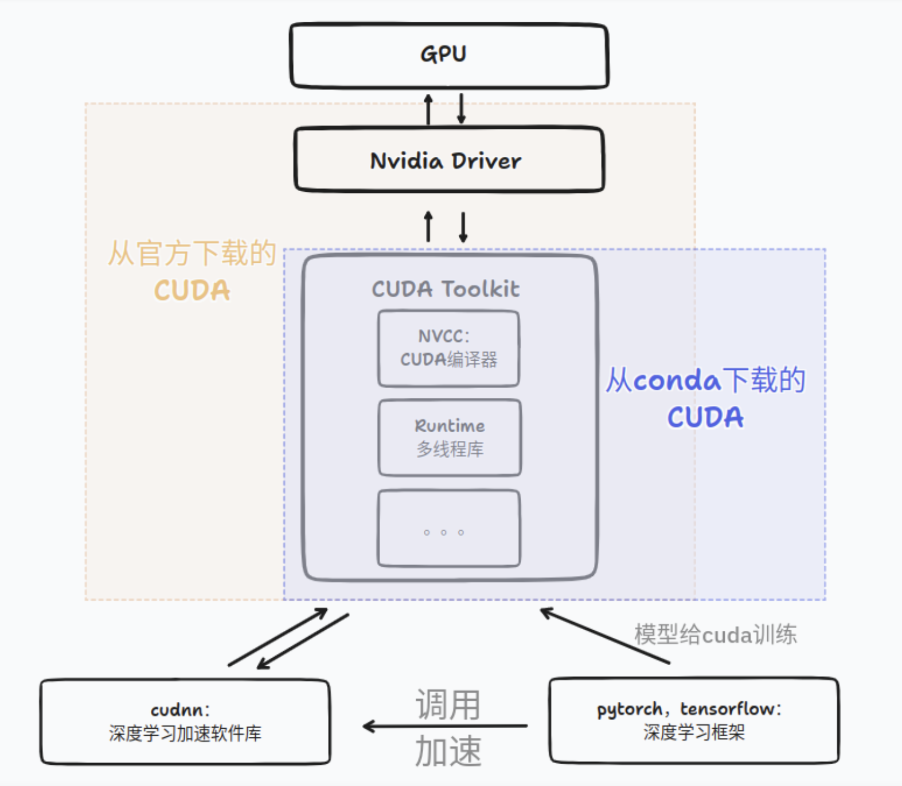

> 年少时候留下的坑，早晚还是得填回来的

### CUDA, CUDA Toolkit, cuDNN, pytorch 的关系

这个 blog

https://blog.csdn.net/Blackoutdragon/article/details/130233562



一张图读懂


### 系统驱动

这个是有 sudo 的 admin 能管的事情。我没有 sudo，下次遇到再说吧


### 查看 CUDA 版本

这里的 CUDA 版本实际上指的是 CUDA Toolkit 的版本。


#### 当前 driver 支持的最高的 CUDA 版本

用 nvidia-smi 指令

```bash
$ nvidia-smi
Tue Nov  4 16:04:53 2025
+-----------------------------------------------------------------------------------------+
| NVIDIA-SMI 565.57.01              Driver Version: 565.57.01      CUDA Version: 12.7     |
|-----------------------------------------+------------------------+----------------------+
```


#### 系统里装了多少个 CUDA

```
ls -l /usr/local | grep cuda
```

正常来说应该得到类似这样的结果，你就知道有哪些 CUDA 了。

```
/usr/local/cuda-11.8
/usr/local/cuda-12.1
/usr/local/cuda
```

#### 我现在在用哪个 cuda

##### 系统的 cuda

`/usr/local/cuda` 指向的地方是系统最终使用的 cuda

但是，在我的机器上出现了这样的情况

```
$ ls -l /usr/local | grep cuda
lrwxrwxrwx  1 root root   22 Mar 25  2024 cuda -> /etc/alternatives/cuda
lrwxrwxrwx  1 root root   25 Mar 25  2024 cuda-12 -> /etc/alternatives/cuda-12
drwxr-xr-x 15 root root 4096 Jun 17 10:57 cuda-12.9
```

这里 cuda 和 cuda-12 都没有明确版本号。这是用了 `update-alternatives` 来管理 cuda 和 cuda-12

这种情况下要用 readline 看最终的落点

```bash
readlink -f /usr/local/cuda
readlink -f /usr/local/cuda-12
```

这个是能够找到的

```
$ readlink -f /usr/local/cuda
/usr/local/cuda-12.9
$ readlink -f /usr/local/cuda-12
/usr/local/cuda-12.9
```

说明系统现在用的 cuda 是 12.9

##### conda 环境里边的 cuda 版本

用指令 

```
nvcc --version
```

得到

```
$ nvcc --version
nvcc: NVIDIA (R) Cuda compiler driver
Copyright (c) 2005-2024 NVIDIA Corporation
Built on Tue_Oct_29_23:50:19_PDT_2024
Cuda compilation tools, release 12.6, V12.6.85
Build cuda_12.6.r12.6/compiler.35059454_0
```

说明现在 conda 里边的 cuda 版本是 12.6


##### pytorch 的 cuda 版本

在 python 里边运行

```
import torch
print(torch.version.cuda)
```

得到

```
>>> print(torch.version.cuda)
12.4
```

说明现在 pytorch 用的 cuda 是 12.4


##### 究竟我在跑 pytorch 的时候在用哪一个

用的是 pytorch 预编译的 12.4

> 也就是说，pytorch 官方发布的轮子本身就是 pytorch + CUDA 预编译的套件，下载下来就能直接用。所以以后直接 pip install torch 其实就行
