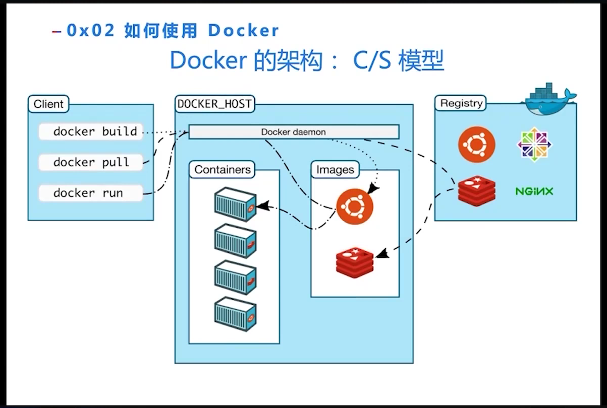

[一个视频速通 docker](https://cloud.baidu.com/video-center/video/606)

## 记住这几个指令你的 docker 就精通了

```bash
# --shm-size 的意思是设置共享内存，好像在多线程的时候这个会有用
docker run \
    -itd \
    --shm-size 32g \
    --gpus all \
    --name sglang_zhizhou \
    -v /opt/dlami/nvme/.cache:/root/.cache \
    -v /opt/dlami/nvme/zhizhou/workspace:/sgl-workspace \
    lmsysorg/sglang:dev \
    /bin/bash

# 每次连接到正在运行的容器
docker exec -it sglang_zhizhou bash
```

## Docker Commands

```bash
docker pull [name]:[tag]

# 查看本地的 image
docker image ls

docker image rm [image ID]

# 从本地路径寻找 Dockerfile 并且构建镜像
docker build -t [name]:[tag] [dockerfile path]

docker push [name]:[tag] {dest_path}
```

## Docker 原理

linux 下 docker 存储在 `/var/lib/docker` 下

没有指定 tag 会默认使用 latest。所以建议指定 tag

镜像删除不掉可能是因为镜像之间有依赖，可以使用 -f 强行删除

## Docker 入门命令

```bash
# -it 代表运行一个交互终端
# -d 表示运行 docker 容器到后台 
docker run -it ubuntu bash

# 查看运行中的容器
docker ps

docker kill [container ID]
```

### 端口映射

```bash
# Port1 是 host 机器的端口
# Port2 是实例内的端口
docker run -p port1:port2 redis

# 例如：将容器的 8080 端口映射到 localhost 的 8000 端口
docker run -p 8000:8080 -d tomcat:80
```

### 目录挂载

```bash
# dir1 host 机的目录
# dir2 Docker 实例内的目录
docker run -v dir1:dir2 redis

# 例如：
docker run -v ~:/user -it ubuntu bash
```

### Docker debug

```bash
# 看容器 log
docker logs [container_id]

# 看容器 / 镜像的元数据，不是很懂
docker inspect [container_id]

# 在 docker 实例中执行交互的 shell 命令
docker exec -it [container_id] bash
docker exec -it [container_id] sh
```

## 实战：从头构建一个 docker 镜像
> 起一个 tomcat 的 webserver

```bash
docker build -t mytomcat:2.0 .

docker run -p 8080:8080 -d mytomcat:1.0

curl localhost:8080

docker logs {容器 id}
```

建立文件挂载
```bash
# 这个挂载成功了
docker run -p 8080:8080 -v /opt/dlami/nvme/zhizhou/workspace/docker_learn:/usr/local/tomcat/webapps/ROOT -d mytomcat:1.0
```


## Trouble shooting

遇到 permission deny
```bash
Docker: Got permission denied while trying to connect to the Docker daemon socket at unix:///var/run/docker.sock
```
运行这个命令
```bash
# 好像这个命令能把自己加到 user group 里边
sudo usermod -a -G docker $USER

# 用这个指令确定你已经被加到 user group 里边
grep docker /etc/group

# 重启终端之后会生效
```

遇到 docker 的名字被重复占用
```bash
docker: Error response from daemon: Conflict. The container name "/sglang_zhizhou" is already in use by container
```

```bash
# 找到是哪个容器在用这个名字
docker ps -a --filter "name=sglang_zhizhou"

# 把这个容器删除掉
docker rm [container_id]
```


docker $\subset$ 容器技术 $\subset$ 虚拟化技术

docker 启动时间是秒级，虚拟机启动时间是分钟级，物理机的建设是月级

docker 架构


Docker hub 是一个类似 github 的地方


