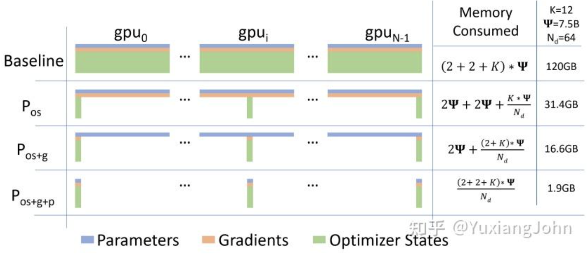
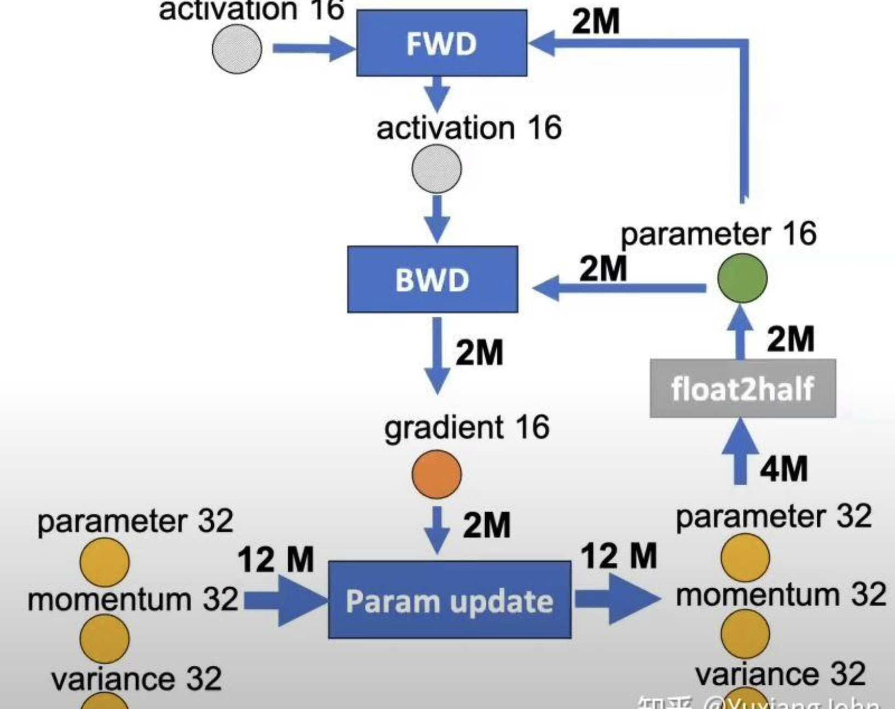

### fsdp 里边的 loss 是怎么计算的

### All Reduce

参考这个 blog

https://zhuanlan.zhihu.com/p/17201336684

All Gather：只进行数据的收集和分发，不进行任何 reduce 操作

Reduce Scatter: 先对数据进行 reduce，然后再对数据进行 scatter

All Reduce: All Gather 和 Reduce Scatter 的组合。先做 reduce scatter，再做 all gather

相当于 All Reduce 比 Reudce scatter 多的是，同步通信

### Zero

看的这个 blog 学的

https://zhuanlan.zhihu.com/p/485208899 

- Zero1：Optimizer sharding
- Zero2：Optimizer sharding & Gradient Sharding
- Zero3: Oprimizer Gradient Model Param Sharding

这里 K 是 optimizer 保存的参数量。这里 Adam 保存了 fp32 weights + 一阶动量 + 二阶动量 = 4 + 4 + 4 = 12

gradient 是对于每一个 parameter 保存了一个 gradient

### 混合精度训练

相当于是 optimizer 保存的都是 fp32 的精度。只是在 forward 和 backward 的时候，转换成了低精度算

注意即使是混合精度训练，最后保存下来的是 chkpt 是 fp32 的。如果要进行分析的话，需要考虑 inference 的时候的 model，所以先要进行精度转换

