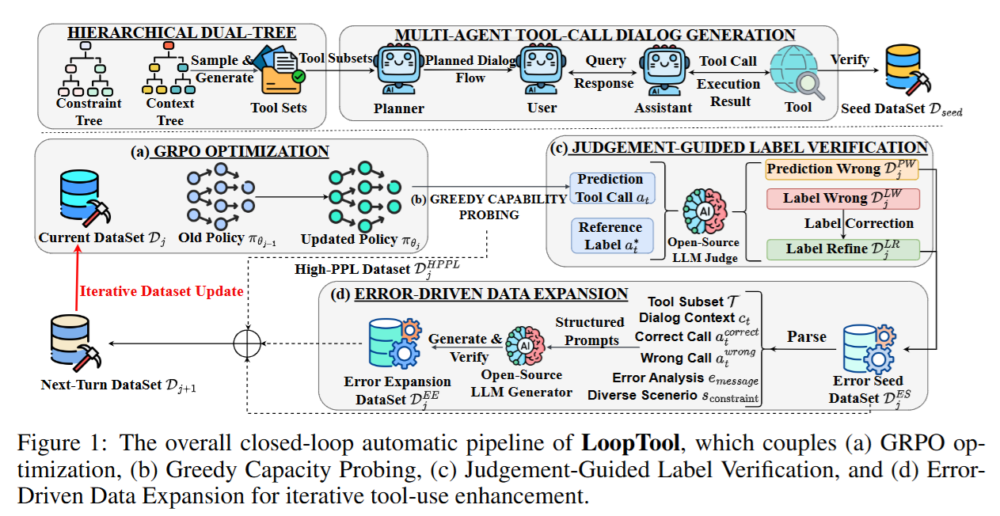

## LLM for tool-call

### TODO

1 看一下 BFCL 具体在测什么

2 看一下 ACEBench具体在测什么

3 看一下 Tool Call 上边 training free 的方法

4 看一下 Language model 上边 training free 的方法，有没有能套上来的

### Benchmark

BFCL: Berkeley Function Calling Leaderboard

paper: https://openreview.net/pdf?id=2GmDdhBdDk 

codebase: https://github.com/ShishirPatil/gorilla/tree/main/berkeley-function-call-leaderboard

live leaderboard: https://gorilla.cs.berkeley.edu/leaderboard.html#leaderboard 

ACEBench

paper: https://arxiv.org/pdf/2501.12851 

codebase: https://github.com/chenchen0103/ACEBench/ 

### Method Paper

LoopTool

https://arxiv.org/pdf/2511.09148 

这个是一个自动化数据增强的 pipeline。

从 (b) 开始，第一步是选出 High Perplexity 的 data；(c) Opensource model 分析来做错误分析和数据集的 correction；(d) 根据错误的类型继续 extend dataset

