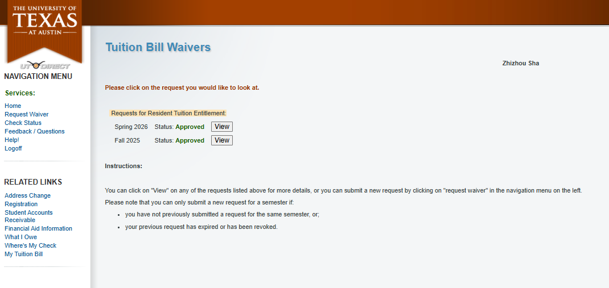
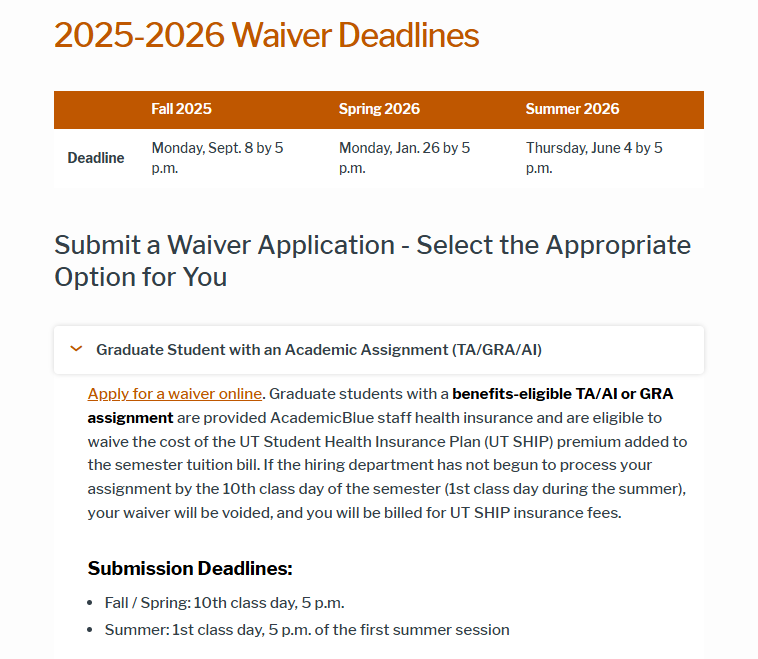
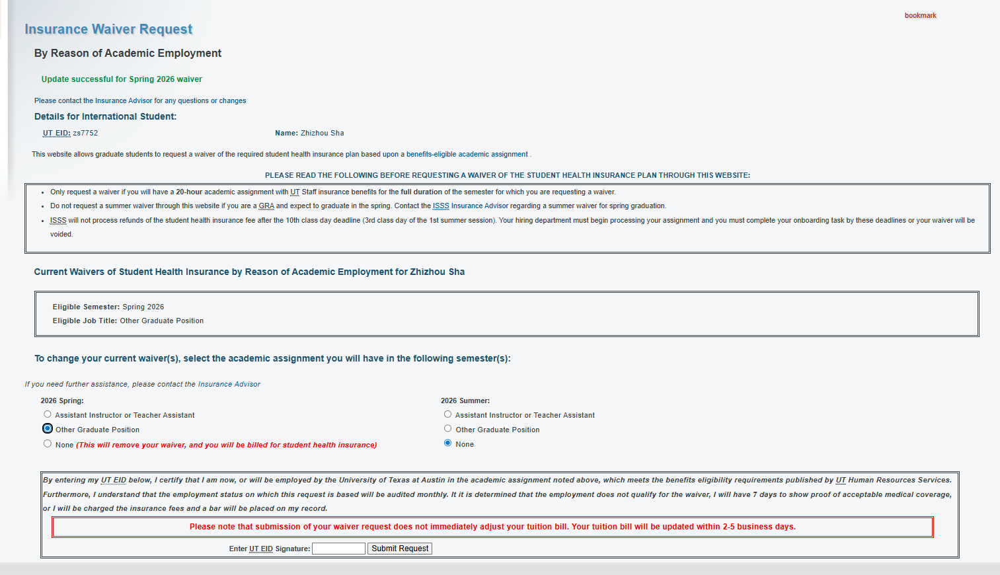
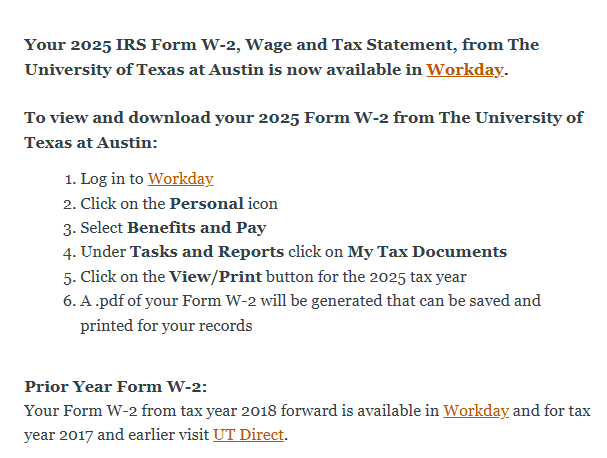
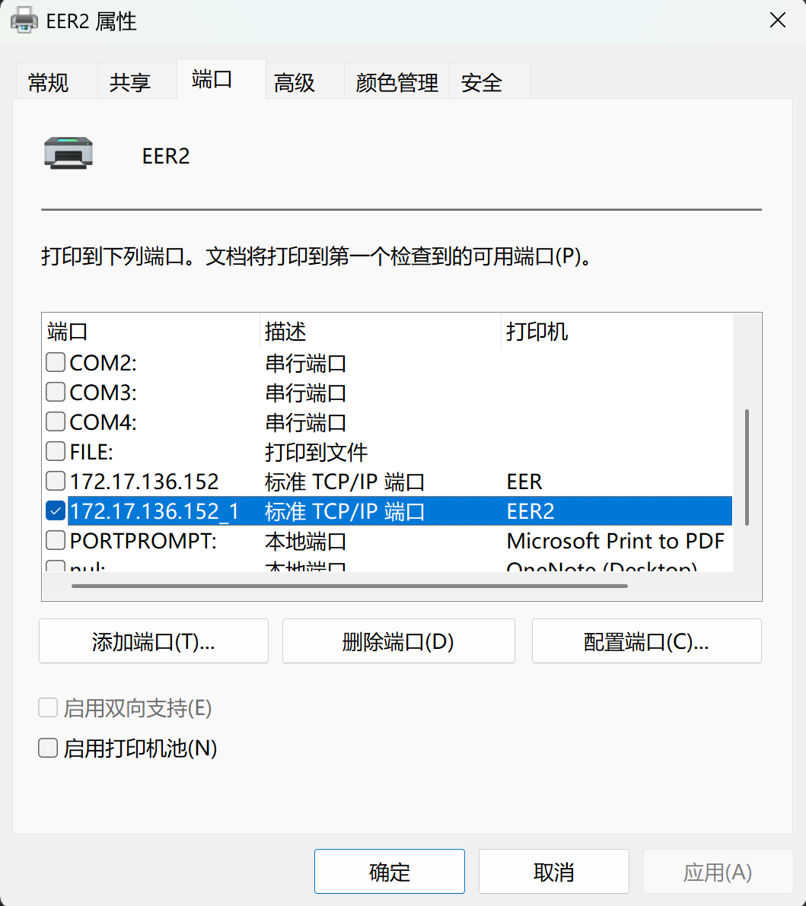
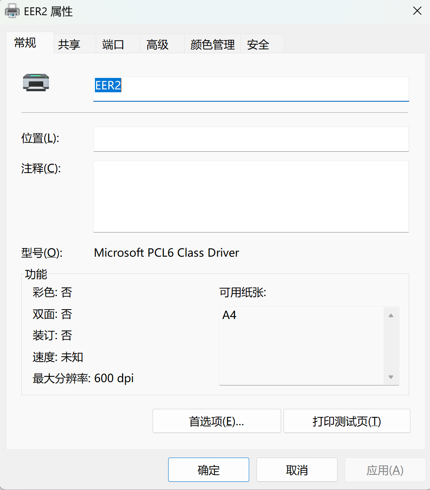
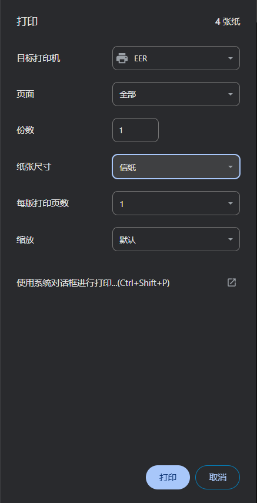

### Austin 的吃的

我真的要哭死了，来美国之前整理了这么多，但是一家都没有去吃过

https://docs.google.com/document/d/1O2AcR0iaFiPkFLSMFryYKLJwDKe48fVvdXJNtdjywtU/edit?usp=sharing 

### ECE student wiki

这个感觉非常非常 nb 啊，有各种各样我需要了解的东西

首先要在这个网站用 UT EID login

https://cloud.wikis.utexas.edu/wiki/spaces/UWS/overview?mode=global

然后去下边这个地址看具体的内容

https://cloud.wikis.utexas.edu/wiki/spaces/WNCG/overview

### UT Austin AHP insurance

收到了这个邮件，看起来必须得处理一下了

做了几个尝试

1 给 international insurance 发邮件  International Insurance <intlinsurance@austin.utexas.edu>

2 给 CS graduate office 发邮件  gradoffice@cs.utexas.edu 

3 给 insurance advisor 发邮件 insuranceadvisor@austin.utexas.edu 

明天去找一下他们

[**Gates Dell Complex**](https://utdirect.utexas.edu/apps/campus/buildings/information/nlogon/maps/UTM/GDC/)
GDC 2.702

Monday - Friday:
8:00 am - 5:00 pm

但是我明天还是去问问他们吧

现在有的信息是，我在这个网站上是有正常的保险的

https://utbenefit-eds.utsystem.edu/shibboleth-ds/index.html?entityID=https%3A%2F%2Futbenefitmembersso.utsystem.edu%2Fsimplesaml%2Fmodule.php%2Fsaml%2Fsp%2Fmetadata.php%2Fdefault-sp&return=https%3A%2F%2Futbenefitmembersso.utsystem.edu%2Fsimplesaml%2Fmodule.php%2Fsaml%2Fsp%2Fdiscoresp.php%3FAuthID%3D_4e398c53134ece2c0a3890f9bbca2dfff670587dca%253Ahttps%253A%252F%252Futbenefitmembersso.utsystem.edu%252Fsimplesaml%252Fsaml2%252Fidp%252FSSOService.php%253Fspentityid%253Dbenefitfocus.com%25253Asp%25253Amember%2526cookieTime%253D1756444051&returnIDParam=idpentityid

这是最原始的邮件

顺着这个链接点进来登陆之后只能看到这个

https://utaustin.myahpcare.com/waiver 

我真的是 wtf 了

现在我的理解是， gra 给的是 bluecross blue field 的 insurance

https://www.bcbstx.com/member 

但是是不是还要在 ahp 上自己交一个 waiver 的申请？

### UT Austin 怎么 waive insurance 和学费

这是 waive 学费的 link

https://utdirect.utexas.edu/acct/fb/waivers/index.WBX 

这是 waive insurance 的

这里下边有一个链接

https://global.utexas.edu/isss/advising-services/insurance/waivers 

点进去是这个网址 https://utdirect.utexas.edu/apps/isss/insr/zs7752/

这样就 waive 完成了

### Summer insurance waiver

在 wncg 的 wiki 这里有写

https://cloud.wikis.utexas.edu/wiki/spaces/WNCG/pages/61932800/Graduate+Student+Appointments+and+Tuition

我理解现在我可以直接 waive 掉 summer 的 insurance

到时候得跟 intern 的公司确认一下保险的事情

Questions about intl insurance should be directed to Texas Global: intlinsurance@austin.utexas.edu.

### W-2

可以直接点这个链接到达 workday

https://t.e2ma.net/click/cn4uoq/sv9w5rph/wmh4ycb 

W2 的作用

**报税用（最重要）**
 你在报联邦税（以及有些州税）的时候，要把 W-2 里的数字填进报税表里。
 W-2 上的“已预扣税”会影响你最后是**退税**还是**补税**。

**证明收入**
 租房、贷款、签证/移民材料、申请信用卡等，有时会要看你一年的工资收入，W-2 是最标准的证明之一。

**核对雇主有没有扣错税**
 比如预扣税太多/太少、社保/医保税、以及你在工资单上看到的累计数字是否一致。

### 1098 T form 

在这里能查看电子版的，但是现在还是 un available

https://utdirect.utexas.edu/acct/rec/irs1098t/index.WBX 

### UT Austin 选课

UT Registration Plus

https://utdirect.utexas.edu/registration/chooseSemester.WBX 

### 如何用学生医保

https://global.utexas.edu/isss/advising-services/insurance/how-to-use 

### Whitaker 网球场预定

https://secure.rs.utexas.edu/app/myrecsports/myreservations.php

### 研究生查自己成绩的网站

https://utdirect.utexas.edu/apps/student/gradereport/student/ 

### CS PhD 毕业 requirement

这是总纲

https://www.cs.utexas.edu/graduate/phd-program/degree-requirements 

总的来说我需要 breadth course 和 depth course

breath course 的要求在这里

https://www.cs.utexas.edu/graduate/courses/breadth-courses 

breadth 最后的脚注里边有一些带星号的课是原来只被算作在 395T 里边的。不能重复算 395T 和 breadth course

### MSCS 毕业标准

两个 track，thesis 和 course work

其中都要求 breadth course，三门课总共 9 学分

除此之外，

- Thesis 要求，其他 CS Grad Course 9 学分，其他 minor 6 学分。thesis 有两门课 6 学分，要分两个学期上
- Coursework，其他 CS Grad Course 15 学分，其他 minor 6 学分

相当于 Thesis thesis 多了两门 thesis 课，Coursework 多了两门 CS Grad Course 

### 本科项目

有两个和交互设计相关的专业

College of Fine Art: Design

https://designcreativetech.utexas.edu/undergraduate-design-program 

这个是他们的本科录取委员会的邮箱

School of Design and Creative Technologies	Nicole Terry	adctadmissions@austin.utexas.edu

iSchool

https://ischool.utexas.edu/programs/informatics

这里也有一个涉及到 UI design 的方向

contact 这个人 https://ischool.utexas.edu/profiles/natasha-saldana 

她的邮箱是 nvs@ischool.utexas.edu 

### eduroam 链接

username 是 zs7752@utexas.edu

密码是 UT EID 的密码

### Travel Reimbursement

到这个 request form 的地方，在 travel 之前要交一个 request 

travel 之后要交一个 reimbursement request

每天的 meal 有 51 刀的额度，剩下的都需要 receipt 才能报销

https://utdirect.utexas.edu/apps/services/requests/

### UT EER Printer

GDC 的 printer 没法用 windows 的电脑链接，所以只能去EER 7 楼的 printer

要用 IP 地址添加 printer 

172.17.136.152 

要选 TCP/IP printer，端口和 IP 地址一样就行

drive 的型号要选 Microsoft PCL6 ，不能选 text only，否则 pdf 打出来是乱码

打印的纸张要选美国信纸（Mac），在 Windows 下边要选 信纸

如果文件过大的话，可能会卡死。但是取消任务之后却又能打印出来，不知道咋回事。这个可以等之后有时间再解决一下