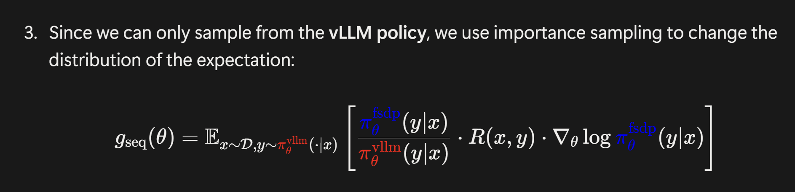
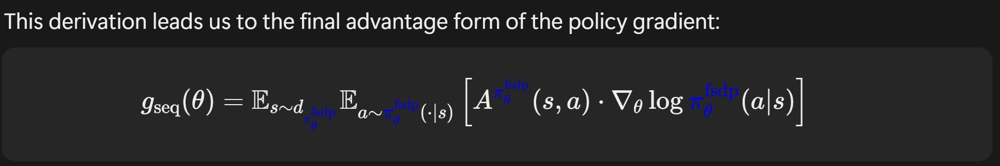
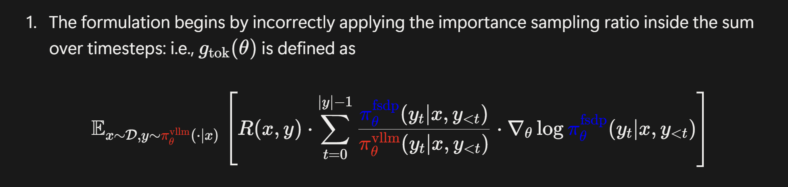
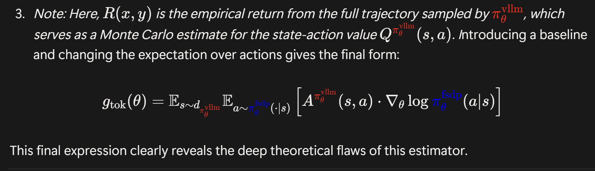
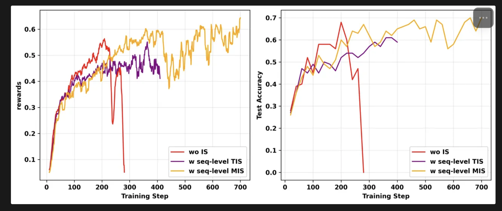
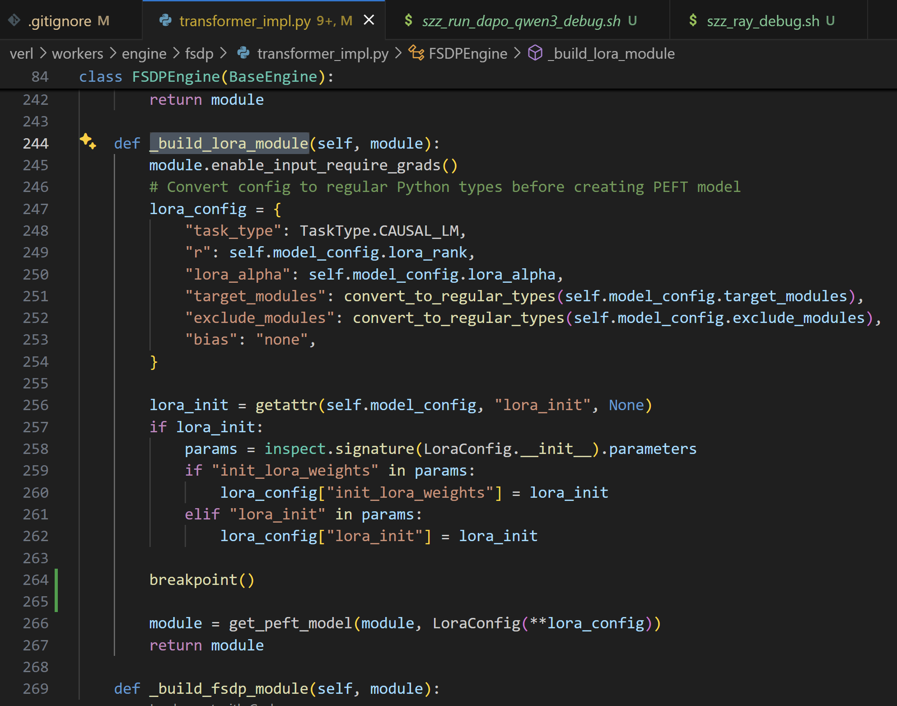
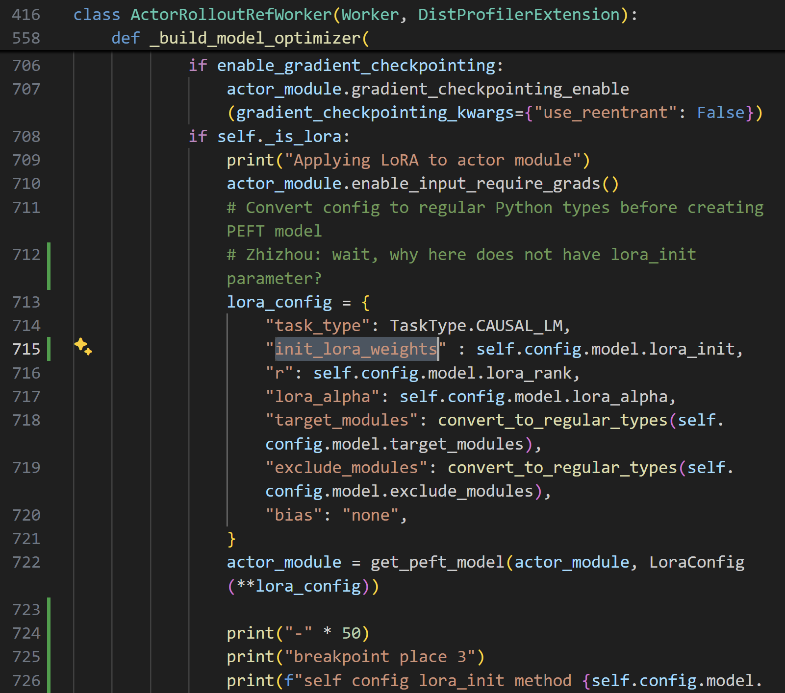
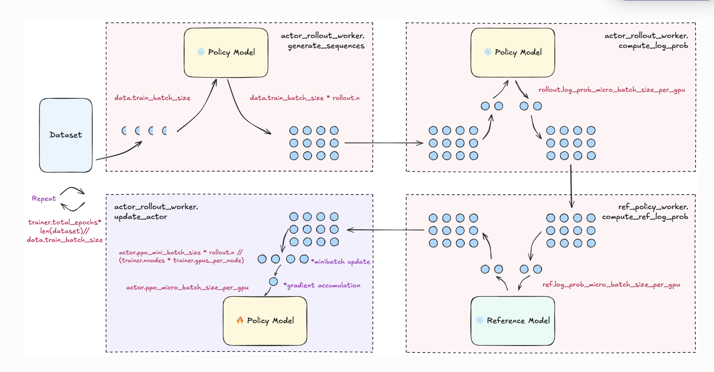
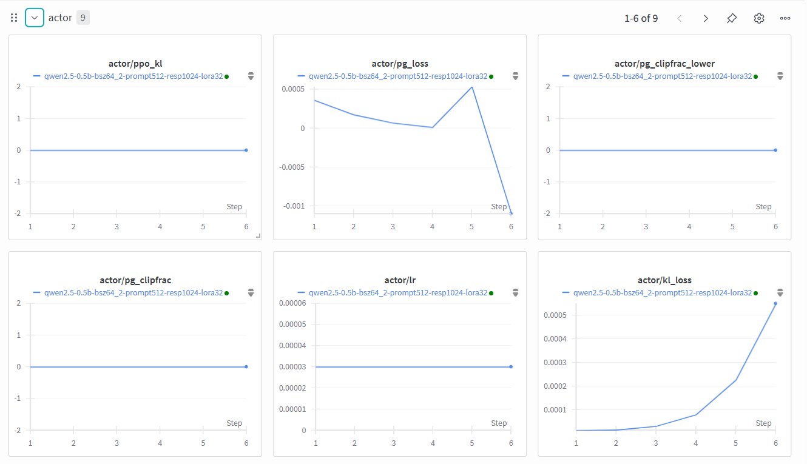

### verl installation

```bash
conda create -n verl1124 python==3.12 -y
conda activate verl1124

USE_MEGATRON=0 USE_SGLANG=0 bash scripts/install_vllm_sglang_mcore.sh

pip install --no-deps -e .
```


### verl 往里边加参数

如果要给 optimizer 加参数的话，要改这几个地方

Step1：Lucky_RL/verl/trainer/config/actor/actor.yaml 里边要给 hydra config 加参数

Step2：Lucky_RL/verl/workers/config/optimizer.py class FSDPOptimizerConfig 要加参数

```
# 这一步要非常小心，要写 data type，否则会 hydra 不认识
svd_muon_use_sgd_only: bool = False
```


注意这里在 shell 里边的时候就不能加前边的 + 这个参数


(Hydra 还是不太会用捏)


### merge fsdp checkpoints

如果是用 fsdp 训练完之后，还得 merge 一下

下边是一个 example script

```
python -m verl.model_merger merge \
    --backend fsdp \
    --local_dir checkpoints/verl_fsdp_gsm8k_examples/qwen2_5_0b5_fsdp_saveload/global_step_1/actor \
    --target_dir /path/to/merged_hf_model
```


### uvloop 的报错

```bash
File "/ssd2/zhizhou/miniconda/envs/best168/lib/python3.10/site-packages/uvloop/__init__.py", line 206, in ge
t_event_loop                                                                                                  
    raise RuntimeError(                                                                                       
RuntimeError: There is no current event loop in thread 'MainThread'.
```

把 uvloop 降级成 0.21.0 就可以了

```bash
pip install uvloop==0.21.0
```


### Importance sampling in verl

notion blog

https://yingru.notion.site/When-Speed-Kills-Stability-Demystifying-RL-Collapse-from-the-Training-Inference-Mismatch-271211a558b7808d8b12d403fd15edda 


verl PR:

https://github.com/volcengine/verl/pull/3694 


#### $g_{\mathrm{seq}}$ 和 $g_{\mathrm{tok}}$ 的区别


$g_{\mathrm{seq}}$ 和 $g_{\mathrm{tok}}$ 的区别在于一个 important ratio ，seq 是用整个序列的 probability 来计算的，



seq 通过推导最终能够实现




而 tok 是用 summation 来计算的




但是 tok 最终只能实现




这里有两点不一样，

1. state occupancy 不一样
2. advantage function 不一样

$g_{\mathrm{seq}}$ 是 ground truth gradient，但是 $g_{\mathrm{tok}}$ 从上述两个地方不一样


#### TIS 和 MIS 的区别

TIS 是 truncated importance sampling

MIS 是 masked importance sampling


相当于把这里的 importance ratio 做 turncated


这里和 PPO 的 truncate 不一样，ppo 里边的 truncated 会导致 gradient 直接变为 0，但是这里的 truncated 不会。因为后边的 R （或者是 advantage function）里边仍然会有梯度



从实验结果上来看 ，seq level 的 MIS 是最好的 combination

- seq level > tok level 这个有理论支撑
-  MIS > TIS 这个只有实验支撑，没有理论支撑。tok level 的 TIS 和 MIS 区别不知道

因此，现有最强的组合是 seq + MIS

还有一个东西是 geometry IS，但是不知道这个东西有多强


### Verl 上的 LoRA 是怎么实现的

今天要干的事情是确认 verl 上的 lora 如果换成别的 peft 的方法，还能不能正确支持。

全部的 lora_init 相关的东西都在这个 folder 下 verl/workers/engine/fsdp/transformer_impl.py



如果换成 pissa 也是在这里换的。事实证明，这个 FSDP Engine 从来没有被 call 过


在 fsdp worker 里边，我们在这里给 actor module 加 LoRA

verl/workers/fsdp_workers.py



光标这里是我新加的。之前完全没有加这个参数


为什么有两个地方调用了 get_peft_model 啊，而且还有一个地方调用里边没有 lora init 这个参数，如果第二个地方被真实调用了的话，会完蛋的


qwen3 4B pissa 的 init 时间只需要两分钟

```
Time to load the model and prepare the PiSSA model: 130.34 seconds
```

但是同样的 lora init 的时间只需要 3 秒钟

```
Time to load the model and prepare the True model: 2.78 seconds
```


在 verl 框架下边测了一下，带 pissa 的启动时间是 300s

```
(TaskRunner pid=3006792) time timetime timetime timetime timetime timetime timetime timetime timetime timetime time
(TaskRunner pid=3006792) [Startup] Launch → training loop took 329.17s
(TaskRunner pid=3006792) time timetime timetime timetime timetime timetime timetime timetime timetime timetime time
```


仅仅 lora 的启动时间是

```
(TaskRunner pid=3204948) time timetime timetime timetime timetime timetime timetime timetime timetime timetime time
(TaskRunner pid=3204948) [Startup] Launch → training loop took 161.94s
(TaskRunner pid=3204948) time timetime timetime timetime timetime timetime timetime timetime timetime timetime time
```


### Algorithm Baseline

这里有 math dataset 上的 baseline 的集合
https://github.com/volcengine/verl/blob/main/docs/algo/baseline.md 

关于 gsm8k 的训练 log 在这里
https://github.com/thelongestusernameofall/verl-data/tree/experiments/gsm8k


### Qwen model names

```
Qwen/Qwen3-0.6B-Base
```


### Verl 训练逻辑

终于慢慢理解了 verl 的训练逻辑了，下边这个链接里边有 verl 的 config 的解释

https://verl.readthedocs.io/en/latest/examples/config.html#config-explain-page 



这里边没懂的是左下角这张图里边，为什么 ppo mini batch size * rollout n 然后再做除法？


### Verl Training log

我现在连 wandb 上 grpo 的 training log 都看不太懂，不过没关系，慢慢来



这里的 pg loss 是 policy gradient loss


### verl 参数理解

这个是 verl 的官方文档

https://verl.readthedocs.io/en/latest/examples/config.html 


tensor_model_parallel_size：TP size for rollout. Only effective for vllm.

指的是把矩阵乘法做切分，比如说 attention dim 4096，有 32 head，TP=4 的话，每个卡处理 1024 dim，处理 8 head


 ulysses_sequence_parallel_size: SP size

这里用的是 Deepspeed Ulysses 的实现。这个相当于是按照 sequence 维度进行切割


