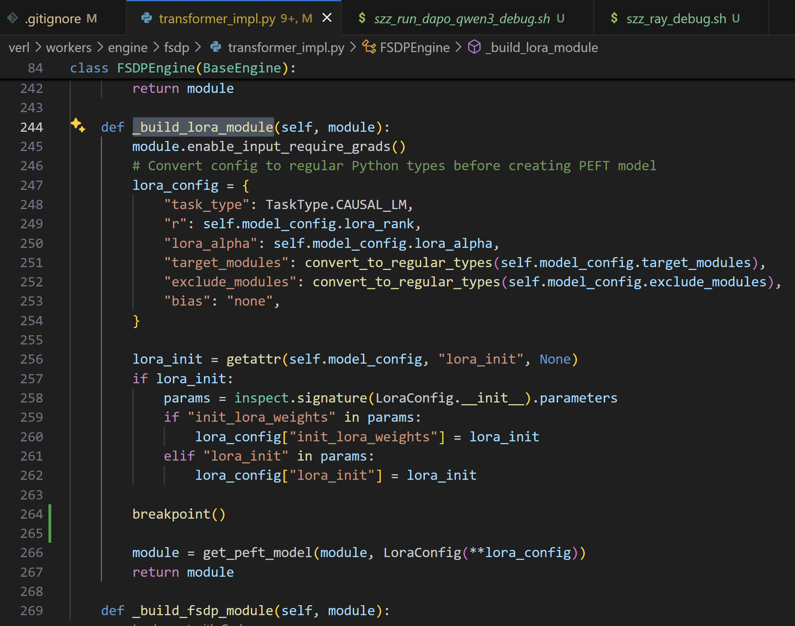
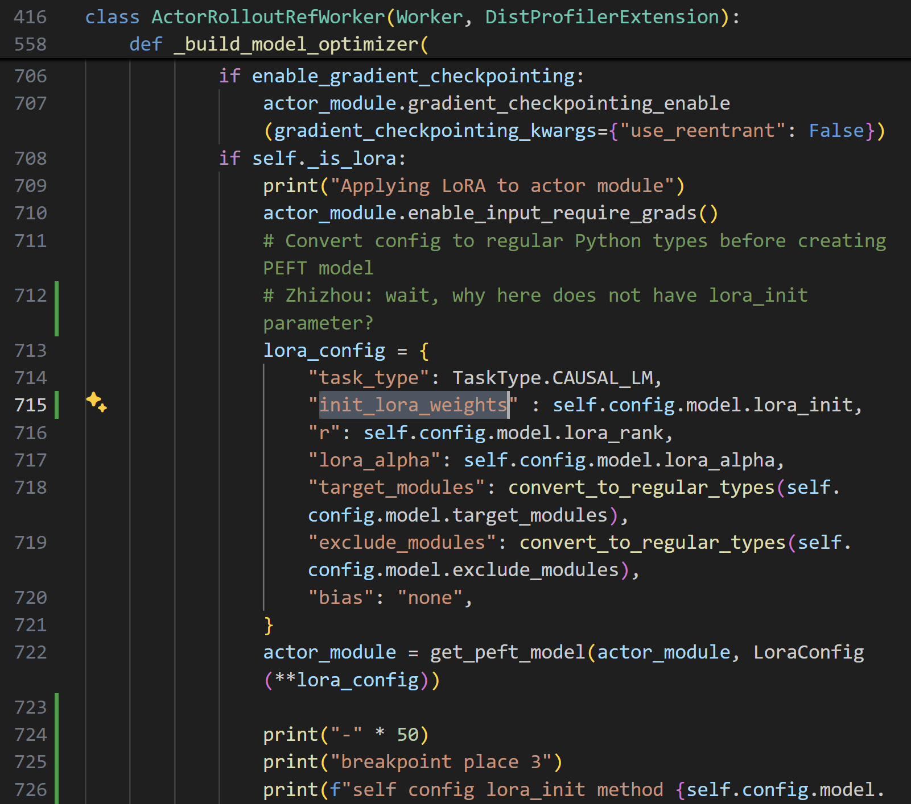

verl installation

```bash
USE_MEGATRON=0 USE_SGLANG=0 bash scripts/install_vllm_sglang_mcore.sh

pip install --no-deps -e .
```


### Trouble Shooting

uvloop 的报错

```bash
File "/ssd2/zhizhou/miniconda/envs/best168/lib/python3.10/site-packages/uvloop/__init__.py", line 206, in ge
t_event_loop                                                                                                  
    raise RuntimeError(                                                                                       
RuntimeError: There is no current event loop in thread 'MainThread'.
```

把 uvloop 降级成 0.21.0 就可以了

```bash
pip install uvloop==0.21.0
```


### Verl 上的 LoRA 是怎么实现的

今天要干的事情是确认 verl 上的 lora 如果换成别的 peft 的方法，还能不能正确支持。

全部的 lora_init 相关的东西都在这个 folder 下 verl/workers/engine/fsdp/transformer_impl.py



如果换成 pissa 也是在这里换的。事实证明，这个 FSDP Engine 从来没有被 call 过


在 fsdp worker 里边，我们在这里给 actor module 加 LoRA

verl/workers/fsdp_workers.py



光标这里是我新加的。之前完全没有加这个参数


为什么有两个地方调用了 get_peft_model 啊，而且还有一个地方调用里边没有 lora init 这个参数，如果第二个地方被真实调用了的话，会完蛋的


qwen3 4B pissa 的 init 时间只需要两分钟

```
Time to load the model and prepare the PiSSA model: 130.34 seconds
```

但是同样的 lora init 的时间只需要 3 秒钟

```
Time to load the model and prepare the True model: 2.78 seconds
```


在 verl 框架下边测了一下，带 pissa 的启动时间是 300s

```
(TaskRunner pid=3006792) time timetime timetime timetime timetime timetime timetime timetime timetime timetime time
(TaskRunner pid=3006792) [Startup] Launch → training loop took 329.17s
(TaskRunner pid=3006792) time timetime timetime timetime timetime timetime timetime timetime timetime timetime time
```


仅仅 lora 的启动时间是

```
(TaskRunner pid=3204948) time timetime timetime timetime timetime timetime timetime timetime timetime timetime time
(TaskRunner pid=3204948) [Startup] Launch → training loop took 161.94s
(TaskRunner pid=3204948) time timetime timetime timetime timetime timetime timetime timetime timetime timetime time
```


### Algorithm Baseline

这里有 math dataset 上的 baseline 的集合
https://github.com/volcengine/verl/blob/main/docs/algo/baseline.md 

关于 gsm8k 的训练 log 在这里
https://github.com/thelongestusernameofall/verl-data/tree/experiments/gsm8k


### Qwen model names

```
Qwen/Qwen3-0.6B-Base
```


### Verl 训练逻辑

终于慢慢理解了 verl 的训练逻辑了，下边这个链接里边有 verl 的 config 的解释

https://verl.readthedocs.io/en/latest/examples/config.html#config-explain-page 


这里边没懂的是左下角这张图里边，为什么 ppo mini batch size * rollout n 然后再做除法？


### Verl Training log

我现在连 wandb 上 grpo 的 training log 都看不太懂，不过没关系，慢慢来


这里的 pg loss 是 policy gradient loss


### verl 参数理解

tensor_model_parallel_size 

指的是把矩阵乘法做切分，比如说 attention dim 4096，有 32 head，TP=4 的话，每个卡处理 1024 dim，处理 8 head


