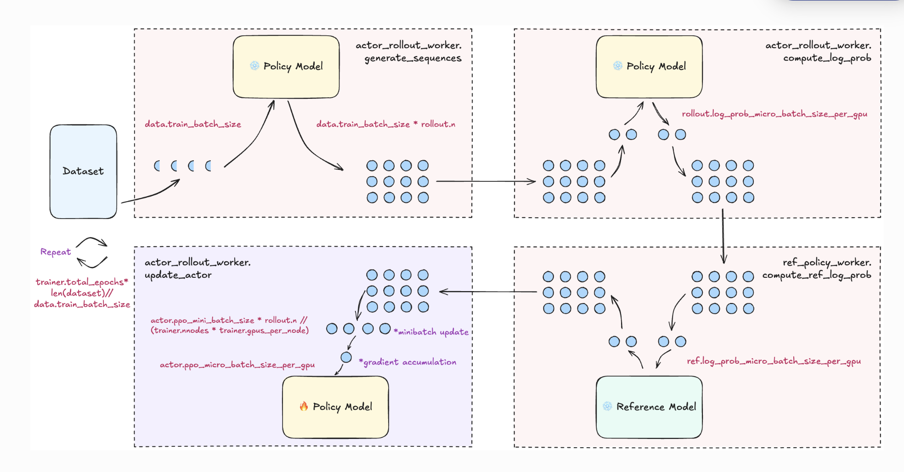
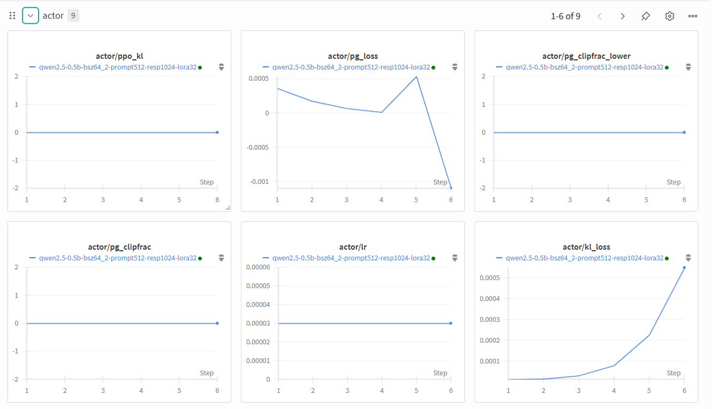

### Algorithm Baseline

这里有 math dataset 上的 baseline 的集合
https://github.com/volcengine/verl/blob/main/docs/algo/baseline.md 

关于 gsm8k 的训练 log 在这里
https://github.com/thelongestusernameofall/verl-data/tree/experiments/gsm8k


### Qwen model names

```
Qwen/Qwen3-0.6B-Base
```


### Verl Config 

终于慢慢理解了 verl 的训练逻辑了，下边这个链接里边有 verl 的 config 的解释

https://verl.readthedocs.io/en/latest/examples/config.html#config-explain-page 



这里边没懂的是左下角这张图里边，为什么 ppo mini batch size * rollout n 然后再做除法？


### Verl Training log

我现在连 wandb 上 grpo 的 training log 都看不太懂，不过没关系，慢慢来



这里的 pg loss 是 policy gradient loss


### verl 参数理解

tensor_model_parallel_size 

指的是把矩阵乘法做切分，比如说 attention dim 4096，有 32 head，TP=4 的话，每个卡处理 1024 dim，处理 8 head


